# Price Monitor — Software Architecture Document

---

| Field | Value |
|---|---|
| Document Title | Software Architecture Document |
| Product | Price Monitor |
| Version | 2.0 |
| Status | Updated — aligned with API Specification v3.0 and Alembic Migrations v2.0 |
| Date | July 2026 |
| Author | Price Monitor Team |

---

## Table of Contents

1. [Document Information](#1-document-information)
2. [Executive Summary](#2-executive-summary)
3. [Functional Requirements](#3-functional-requirements)
4. [Non-Functional Requirements](#4-non-functional-requirements)
5. [Design Principles](#5-design-principles)
6. [Technology Stack](#6-technology-stack)
7. [High-Level Architecture](#7-high-level-architecture)
8. [Deployment Architecture](#8-deployment-architecture)
9. [Component Architecture](#9-component-architecture)
10. [Sequence Diagrams](#10-sequence-diagrams)
11. [Database Design](#11-database-design)
12. [Entity Relationship Diagram](#12-entity-relationship-diagram)
13. [Queue Design](#13-queue-design)
14. [Worker Architecture](#14-worker-architecture)
15. [Playwright Design](#15-playwright-design)
16. [API Design Overview](#16-api-design-overview)
17. [Security Design](#17-security-design)
18. [Logging and Monitoring](#18-logging-and-monitoring)
19. [Configuration Management](#19-configuration-management)
20. [Error Handling Strategy](#20-error-handling-strategy)
21. [Cost Optimisation](#21-cost-optimisation)
22. [Scalability Roadmap](#22-scalability-roadmap)
23. [Future Enhancements](#23-future-enhancements)
24. [Design Decisions](#24-design-decisions)
25. [Assumptions and Limitations](#25-assumptions-and-limitations)
26. [Appendix](#26-appendix)

---

## 1. Document Information

### 1.1 Purpose

This Software Architecture Document (SAD) defines the complete high-level architecture for Price Monitor. It serves as the authoritative reference for all subsequent documents, including the Low-Level Design (LLD), API Specification, database migration scripts, and implementation tasks. Any design decision made during implementation that deviates from this document should trigger an update here.

### 1.2 Scope

This document covers:

- System context and external dependencies
- High-level and deployment architecture
- All internal components and their responsibilities
- Database schema and entity relationships
- Worker model, queue design, and concurrency strategy
- Sequence flows for all primary use cases
- Security, logging, error handling, and configuration strategy
- Design rationale using Architecture Decision Records (ADRs)
- Future extension points aligned with the product roadmap

This document does **not** cover:

- Individual API endpoint contracts (deferred to API Specification)
- SQL migration scripts (deferred to database implementation)
- Class diagrams and method signatures (deferred to LLD)
- UI wireframes and Streamlit component design (deferred to UI Design doc)

### 1.3 Intended Audience

| Audience | Sections of primary interest |
|---|---|
| Developer (implementer) | All sections |
| Code reviewer | 7, 9, 10, 11, 14, 15, 24 |
| New team member (onboarding) | 2, 7, 8, 11, 12 |
| Future architect (scaling) | 4, 22, 23, 24 |

### 1.4 Version History

| Version | Date | Author | Changes |
|---|---|---|---|
| 1.0 | July 2026 | Price Monitor Team | Initial release — design finalised |
| 2.0 | July 2026 | Price Monitor Team | Aligned with API Specification v3.0 and Alembic Migrations v2.0: two-step preview/confirm flow; products table extended with marketplace_product_id, brand, rating, review_count, seller; price_history run_id made nullable; preview cache decision documented; ADR-011, ADR-012 added |

### 1.5 References

| Document | Status |
|---|---|
| Product Requirements Document (PRD) | Finalised |
| Low-Level Design | Pending (depends on this SAD) |
| API Specification | Finalised (v3.0) |
| Database Migration Scripts | Finalised (v2.0) |

---

## 2. Executive Summary

### 2.1 Project Overview

Price Monitor is a web application that tracks product prices on Amazon India and Flipkart. Users submit a product URL and their email address. The system periodically scrapes the product page, stores price history, and sends an email notification whenever the price drops. Multiple users can track the same product — scraping happens once per URL, and notifications are fanned out to all subscribers.

### 2.2 Problem Statement

Online shoppers in India frequently miss price drops on products they want to buy. Manually refreshing product pages is tedious and unreliable. Price Monitor automates this by monitoring prices in the background and notifying users at the moment a price drop occurs, enabling better purchase decisions without continuous manual effort.

### 2.3 Business Goals

- Provide reliable, near-real-time price drop notifications with minimal user effort
- Support Amazon India and Flipkart from day one (the two dominant Indian e-commerce platforms)
- Operate at near-zero cost during the MVP phase (~$5/month)
- Establish a clean, extensible architecture that supports a multi-phase product roadmap without major rewrites

### 2.4 MVP Scope

| Feature | Included in MVP |
|---|---|
| Track Amazon India product URL | Yes |
| Track Flipkart product URL | Yes |
| Email notification on price drop | Yes |
| Shared product catalog (scrape once per URL) | Yes |
| Dashboard — view tracked items | Yes |
| Add and delete tracked items | Yes |
| Price history storage | Yes (storage only — no UI chart) |
| Run-level audit trail (scheduler_runs) | Yes |
| User login and authentication | No (Phase 7) |
| Price history charts | No (Phase 2) |
| Target price alerts | No (Phase 3) |
| Card and bank discount scraping | No (Phase 4) |
| SMS / WhatsApp / Telegram notifications | No (Phase 6) |

### 2.5 Future Roadmap

| Phase | Theme | Key features |
|---|---|---|
| 2 | Better tracking | Price history charts, all-time low badge, manual refresh |
| 3 | Smarter alerts | Target price, percentage drop threshold, notification cooldown |
| 4 | Offers and discounts | Card discounts, coupon codes, cashback, EMI |
| 5 | More platforms | Croma, Reliance Digital, Myntra, Apple India |
| 6 | More channels | SMS, WhatsApp, Telegram, push notifications |
| 7 | Advanced features | User login, admin role, sale prediction, cross-platform comparison, browser extension, mobile app |

---

## 3. Functional Requirements

### FR-1 Product Tracking

- User submits a product URL and email address
- System validates the URL (supported platform, valid product page pattern)
- System checks if the product already exists in the catalog
  - If yes: create a subscription only — do not re-scrape
  - If no: scrape product details, create product record, create subscription
- Scraped details: product name, product image URL, current price, availability, platform

### FR-2 Shared Product Catalog

- A product URL is stored exactly once in the `products` table regardless of how many users track it
- All users tracking the same URL share a single product record and a single scrape job
- The unique constraint on `products.url` enforces this at the database level

### FR-3 Price Monitoring

- Prices are checked every 4 hours for all tracked products
- Each scrape fetches the current price from the live product page
- Scraped price is compared against `products.current_price`
- If scraped price < current_price → price drop detected
- If scraped price >= current_price → no action beyond logging

### FR-4 Price History

- Every scrape result is written to `price_history` regardless of whether the price changed
- Each `price_history` row is linked to the `scheduler_run` that produced it
- Scrape failures are also recorded with `scrape_status = 'failed'` or `'blocked'`

### FR-5 Email Notification

- On price drop: send one email per subscriber for that product
- Email content: product name, product image, old price, new price, drop amount, drop percentage, direct link to product page
- Notifications are dispatched asynchronously via the email queue — they do not block the scraper

### FR-6 Dashboard

- User enters their email to view their tracked items
- Each item displays: product image, product name, current price, availability, platform, last checked time
- No authentication required in MVP — email is the identifier

### FR-7 Product Management

- User can add a product by submitting URL + email
- User can delete their subscription to a product
- Deleting a subscription removes only the user's subscription row
- If no subscribers remain for a product, the product record is also deleted

---

## 4. Non-Functional Requirements

### NFR-1 Performance

- Price check cycle completes for up to 500 products within the 4-hour scrape window
- Individual scrape per product: target < 10 seconds per page
- API response time: < 500ms for dashboard load (database query only, no scraping)
- Email delivery: within 2 minutes of price drop detection

### NFR-2 Scalability

- MVP target: up to 500 tracked products, up to 1,000 users
- Architecture must support horizontal scaling of the scraper worker pool without code changes
- Queue abstraction (using `queue.Queue`) allows a drop-in replacement with Redis when scale demands it

### NFR-3 Reliability

- Scraper failures for individual products must not affect other products in the same run
- Worker crashes must be automatically recovered by the Worker Manager within 30 seconds
- Partial run failures (some products failed) must be recorded and surfaced — they must not be silently swallowed
- Email delivery failures must be retried with exponential backoff

### NFR-4 Maintainability

- All components have a single clearly defined responsibility
- No component has direct knowledge of components more than one layer away
- Swapping any external service (email provider, database, queue) requires changes in one place only

### NFR-5 Extensibility

- Adding a new platform (e.g. Croma) requires implementing one new scraper class — no changes to the worker or scheduler
- Adding a new notification channel (e.g. SMS) requires adding one new worker and queue — no changes to the scraper
- The queue abstraction allows a zero-code-change upgrade from `queue.Queue` to Redis

### NFR-6 Security

- All secrets stored as environment variables — never in source code
- Database credentials, API keys, and SMTP credentials managed via Railway environment and GitHub Actions secrets
- No user passwords stored in MVP (email-only identification)
- SQL injection prevented by using parameterised queries via SQLAlchemy

### NFR-7 Cost Optimisation

- Total infrastructure cost: ~$5/month (Railway only) for MVP scale
- All other services operate within free tiers
- Architecture avoids always-on compute for the scraper by using GitHub Actions cron

### NFR-8 Observability

- Every scheduled run is recorded in `scheduler_runs` with start time, end time, status, and metrics
- Every scrape result is recorded in `price_history` with `scrape_status`
- Structured logging for all components with log levels (DEBUG, INFO, WARNING, ERROR)
- Partial run detection: `status = 'partial'` when any product fails after retries

---

## 5. Design Principles

### P-1: One Product, Multiple Subscribers

A product URL is scraped once per cycle, regardless of how many users track it. Notifications fan out from a single scrape result. This is the foundational efficiency principle — it means adding the 100th user tracking a product costs zero additional scraping work.

### P-2: Scrape Once

Deduplication happens at the moment a user submits a URL. If the URL already exists in `products`, only a subscription row is created. The scraper never sees the same URL more than once per cycle.

### P-3: Queue-Based Processing

Scheduling, scraping, and notification are decoupled through in-memory queues. The scheduler only enqueues — it does not scrape. Workers only dequeue and scrape — they do not schedule. The email worker only sends — it does not scrape or schedule. This separation makes each component independently testable and replaceable.

### P-4: Stateless Scheduler

The scheduler holds no state. It reads from the database each run to determine what to scrape. A scheduler restart or crash loses nothing — the next run reads the same data.

### P-5: Managed Services First

The system uses managed services (Supabase for Postgres, Sendgrid for email, Railway for hosting) rather than self-managed infrastructure. This eliminates operational overhead during MVP and allows the team to focus on product logic.

### P-6: Low Operational Cost

Every infrastructure choice is evaluated against its free-tier limits. The target is to run the full MVP stack for under $10/month with a clear scaling path that adds cost proportionally to growth.

### P-7: Cloud Agnostic Where Possible

The application code does not assume a specific cloud provider. FastAPI and the worker processes can run on any Python host. The database connection uses a standard PostgreSQL connection string. Migrating from Railway to Oracle Cloud or any other host requires environment variable changes only.

### P-8: Fail Visibly

A failed scrape is always logged. A failed run is always marked. Silent failures — where the system appears healthy but is not scraping — are unacceptable. The `scheduler_runs` table is the primary instrument for detecting silent failure.

---

## 6. Technology Stack

| Component | Technology | Version | Why Selected | Alternatives Considered |
|---|---|---|---|---|
| UI framework | Streamlit | Latest | Python-native, fast to build, free hosting on Streamlit Cloud. Swappable later without backend changes. | React (more powerful but requires separate deployment and JS expertise), Django templates (tightly coupled to backend) |
| API framework | FastAPI | 0.100+ | Async support, automatic OpenAPI docs, clean dependency injection, supports background threads for APScheduler. | Flask (no async, no auto docs), Django REST Framework (heavier) |
| Database | PostgreSQL via Supabase | Postgres 15 | Relational model is the right fit for subscriptions and price history. Supabase provides managed Postgres with a generous free tier. | MySQL (fewer advanced features), SQLite (not suitable for production), MongoDB (no relational integrity) |
| ORM | SQLAlchemy | 2.x | Industry-standard Python ORM, supports async, clean migration path with Alembic. | Tortoise ORM (less mature), raw psycopg2 (no abstraction) |
| Migrations | Alembic | Latest | Works natively with SQLAlchemy, version-controlled schema changes. | Manual SQL scripts (no version control), Flyway (JVM dependency) |
| Scraping | Playwright + playwright-stealth | Latest | Handles JavaScript-rendered pages on Amazon and Flipkart. Stealth plugin reduces bot detection fingerprinting. | Selenium (older, slower), Scrapy (not designed for JS-heavy sites), BeautifulSoup + requests (cannot execute JS) |
| Scrape fallback | ScraperAPI | Free tier | 1,000 free requests/month. Used as fallback only when Playwright is blocked. | Oxylabs (expensive), Bright Data (expensive), Zyte (expensive) |
| Scheduler | APScheduler | 3.x | Lightweight, runs in-process with FastAPI, no additional infrastructure. | Celery (requires Redis), cron (OS-level, not portable), Airflow (far too heavy) |
| Primary trigger | GitHub Actions | — | Free for public repos, 2,000 min/month for private. Fresh Ubuntu runner with 7 GB RAM — ample for Playwright pool. | Cron on Railway (costs money), AWS EventBridge (complexity) |
| Job queues | Python `queue.Queue` | stdlib | Zero dependencies, thread-safe, sufficient for MVP scale. Explicit upgrade path to Redis. | Redis (adds infrastructure cost and complexity at MVP scale), RabbitMQ (even heavier) |
| Email | SendGrid | Free tier | 100 emails/day free, reliable delivery, clean Python SDK. | Gmail SMTP (rate-limited, not suitable for production), AWS SES (needs AWS account), Mailgun (smaller free tier) |
| API documentation | FastAPI auto-docs (OpenAPI) | — | Zero-effort — FastAPI generates Swagger UI and ReDoc automatically from type annotations. | Manually written YAML (error-prone, gets out of sync) |
| Hosting (API) | Railway | — | Managed deployment from GitHub, automatic TLS, built-in environment variable management, ~$5/month. | Render (free tier sleeps — bad for an API), Heroku (discontinued free tier), Oracle Cloud Free Tier (requires manual server management) |
| Hosting (UI) | Streamlit Community Cloud | Free | Native Streamlit deployment, free, deploys directly from GitHub. | Vercel (not designed for Streamlit), Railway (costs money when Streamlit Cloud is free) |

---

## 7. High-Level Architecture

### 7.1 System Context

Price Monitor sits between users (who submit URLs and receive email alerts) and two external e-commerce platforms (Amazon India and Flipkart). It interacts with three external services: Supabase for persistence, SendGrid for email delivery, and GitHub Actions for scheduled execution.

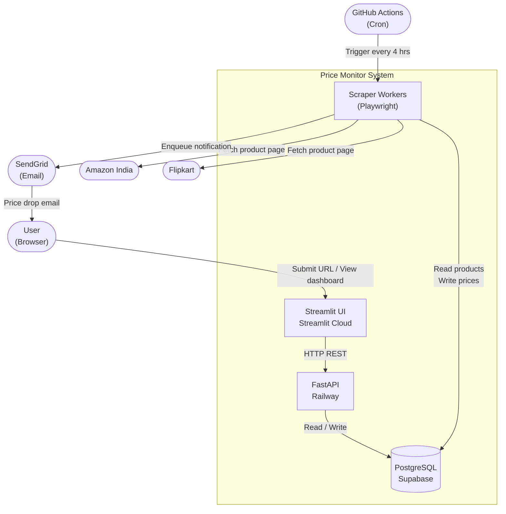
```mermaid
flowchart TB
    User(["User\n(Browser)"])
    Amazon(["Amazon India"])
    Flipkart(["Flipkart"])
    SendGrid(["SendGrid\n(Email)"])
    GitHub(["GitHub Actions\n(Cron)"])

    subgraph PriceMonitor["Price Monitor System"]
        UI["Streamlit UI\nStreamlit Cloud"]
        API["FastAPI\nRailway"]
        DB[("PostgreSQL\nSupabase")]
        Scraper["Scraper Workers\n(Playwright)"]
    end

    User -->|"Submit URL / View dashboard"| UI
    UI -->|"HTTP REST"| API
    API -->|"Read / Write"| DB
    GitHub -->|"Trigger every 4 hrs"| Scraper
    Scraper -->|"Read products\nWrite prices"| DB
    Scraper -->|"Fetch product page"| Amazon
    Scraper -->|"Fetch product page"| Flipkart
    Scraper -->|"Enqueue notification"| SendGrid
    SendGrid -->|"Price drop email"| User
```

### 7.2 High-Level Component Architecture

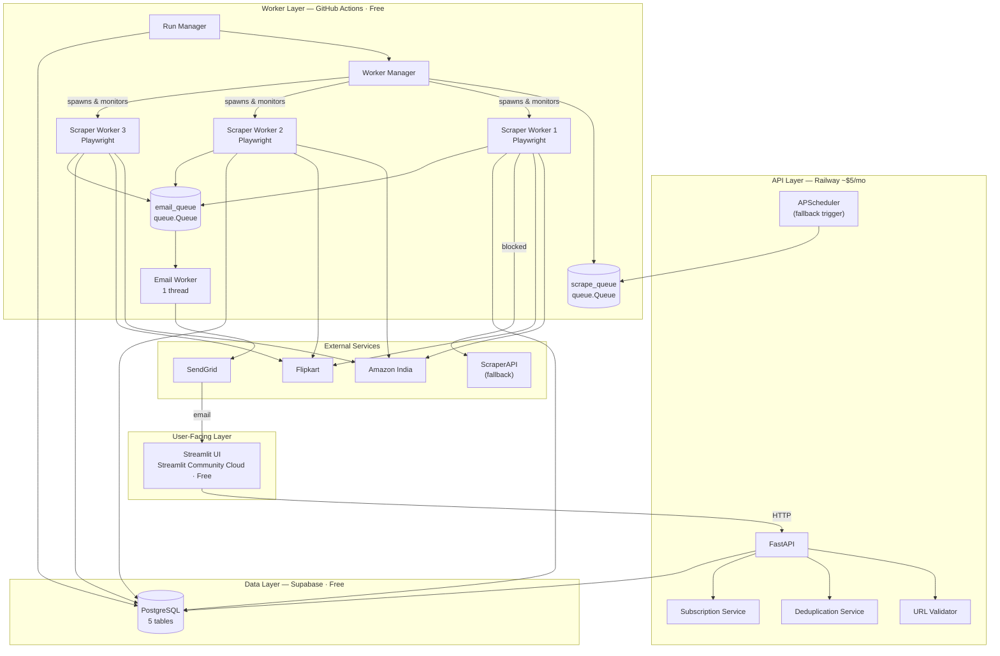
```mermaid
flowchart TB
    subgraph UserFacing["User-Facing Layer"]
        UI["Streamlit UI\nStreamlit Community Cloud · Free"]
    end

    subgraph APILayer["API Layer — Railway ~$5/mo"]
        API["FastAPI"]
        Validator["URL Validator"]
        DeduplicatorSvc["Deduplication Service"]
        SubscriptionSvc["Subscription Service"]
        Scheduler["APScheduler\n(fallback trigger)"]
    end

    subgraph WorkerLayer["Worker Layer — GitHub Actions · Free"]
        RunMgr["Run Manager"]
        WorkerMgr["Worker Manager"]
        ScrapeQ[("scrape_queue\nqueue.Queue")]
        EmailQ[("email_queue\nqueue.Queue")]
        W1["Scraper Worker 1\nPlaywright"]
        W2["Scraper Worker 2\nPlaywright"]
        W3["Scraper Worker 3\nPlaywright"]
        EmailWorker["Email Worker\n1 thread"]
    end

    subgraph DataLayer["Data Layer — Supabase · Free"]
        DB[("PostgreSQL\n5 tables")]
    end

    subgraph External["External Services"]
        Amazon["Amazon India"]
        Flipkart["Flipkart"]
        SendGrid["SendGrid"]
        ScraperAPI["ScraperAPI\n(fallback)"]
    end

    UI -->|"HTTP"| API
    API --> Validator
    API --> DeduplicatorSvc
    API --> SubscriptionSvc
    API --> DB

    RunMgr --> WorkerMgr
    RunMgr --> DB
    WorkerMgr --> ScrapeQ
    WorkerMgr -->|"spawns & monitors"| W1
    WorkerMgr -->|"spawns & monitors"| W2
    WorkerMgr -->|"spawns & monitors"| W3
    W1 --> Amazon
    W1 --> Flipkart
    W2 --> Amazon
    W2 --> Flipkart
    W3 --> Amazon
    W3 --> Flipkart
    W1 -->|"blocked"| ScraperAPI
    W1 --> DB
    W2 --> DB
    W3 --> DB
    W1 --> EmailQ
    W2 --> EmailQ
    W3 --> EmailQ
    EmailQ --> EmailWorker
    EmailWorker --> SendGrid
    SendGrid -->|"email"| UI

    Scheduler --> ScrapeQ
```

### 7.3 Two-Part Split Rationale

The system is deliberately split into two independently deployed parts:

**Web application (Railway):** Always-on. Handles user interactions — adding products, viewing the dashboard, deleting subscriptions. Must respond quickly. Contains FastAPI, the URL validator, subscription management, and APScheduler as a fallback trigger.

**Scraper (GitHub Actions):** Runs on a cron schedule. Stateless between runs — reads all products from the database, scrapes them, writes results, sends notifications, then exits. Runs on free infrastructure (GitHub Actions Ubuntu runner with 7 GB RAM).

The two parts share only the Supabase database. They do not communicate directly. This separation means a scraper crash cannot affect the web application, and a web application deployment cannot affect a scraper run in progress.

---

## 8. Deployment Architecture

### 8.1 Deployment Diagram

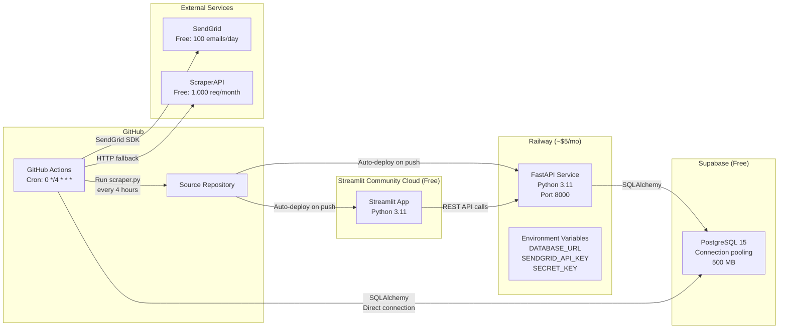
```mermaid
flowchart LR
    subgraph GitHub["GitHub"]
        Repo["Source Repository"]
        Actions["GitHub Actions\nCron: 0 */4 * * *"]
    end

    subgraph Railway["Railway (~$5/mo)"]
        FastAPIService["FastAPI Service\nPython 3.11\nPort 8000"]
        EnvVars["Environment Variables\nDATABASE_URL\nSENDGRID_API_KEY\nSECRET_KEY"]
    end

    subgraph StreamlitCloud["Streamlit Community Cloud (Free)"]
        StreamlitApp["Streamlit App\nPython 3.11"]
    end

    subgraph Supabase["Supabase (Free)"]
        PG["PostgreSQL 15\nConnection pooling\n500 MB"]
    end

    subgraph ExternalSvcs["External Services"]
        SG["SendGrid\nFree: 100 emails/day"]
        SAPI["ScraperAPI\nFree: 1,000 req/month"]
    end

    Repo -->|"Auto-deploy on push"| FastAPIService
    Repo -->|"Auto-deploy on push"| StreamlitApp
    Actions -->|"Run scraper.py\nevery 4 hours"| Repo
    StreamlitApp -->|"REST API calls"| FastAPIService
    FastAPIService -->|"SQLAlchemy"| PG
    Actions -->|"SQLAlchemy\nDirect connection"| PG
    Actions -->|"SendGrid SDK"| SG
    Actions -->|"HTTP fallback"| SAPI
```

### 8.2 Deployment Workflow

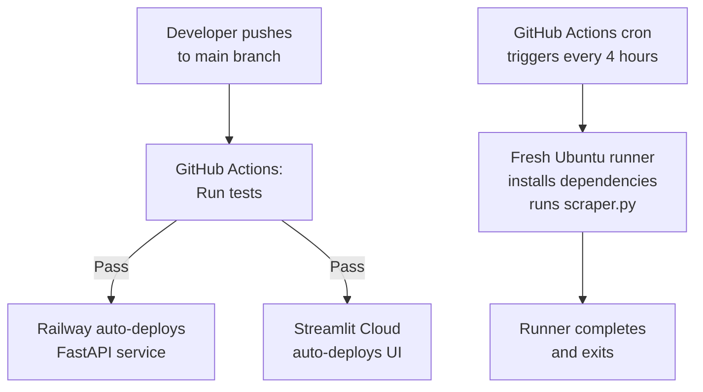
```mermaid
flowchart TD
    Push["Developer pushes\nto main branch"]
    GHTest["GitHub Actions:\nRun tests"]
    DeployRailway["Railway auto-deploys\nFastAPI service"]
    DeployStreamlit["Streamlit Cloud\nauto-deploys UI"]
    CronTrigger["GitHub Actions cron\ntriggers every 4 hours"]
    RunScraper["Fresh Ubuntu runner\ninstalls dependencies\nruns scraper.py"]
    ScraperDone["Runner completes\nand exits"]

    Push --> GHTest
    GHTest -->|"Pass"| DeployRailway
    GHTest -->|"Pass"| DeployStreamlit
    CronTrigger --> RunScraper
    RunScraper --> ScraperDone
```

### 8.3 Environment Variables

| Variable | Used By | Description |
|---|---|---|
| `DATABASE_URL` | FastAPI, GitHub Actions | Supabase PostgreSQL connection string |
| `SENDGRID_API_KEY` | GitHub Actions | SendGrid API key for email delivery |
| `SCRAPER_API_KEY` | GitHub Actions | ScraperAPI key for fallback scraping |
| `SECRET_KEY` | FastAPI | Internal API token for scheduler endpoint |
| `MAX_SCRAPER_WORKERS` | GitHub Actions | Number of Playwright workers (default: 3) |
| `SCRAPE_RETRY_LIMIT` | GitHub Actions | Max retries per product (default: 3) |
| `LOG_LEVEL` | FastAPI, GitHub Actions | Logging verbosity (default: INFO) |

---

## 9. Component Architecture

### 9.1 Streamlit UI

**Responsibilities:**
- Render the user dashboard (tracked items with current price and availability)
- Provide an "Add Item" form (URL + email input)
- Provide a "Delete" action per tracked item
- Call FastAPI REST endpoints for all data operations — no direct database access

**Pages / Views:**
- `Dashboard` — lists all items tracked by the user's email, with price, availability, platform, last checked
- `Add Item` — form to submit a product URL and email address
- (Future) `Price History` — chart of historical prices for a selected product

**Dependencies:**
- FastAPI (via HTTP) — all data reads and writes go through the API
- `requests` library — for HTTP calls to FastAPI

**Communication pattern:** HTTP REST. Streamlit calls `GET /items?email=...`, `POST /track`, `DELETE /track/{subscription_id}`.

**Future enhancements:**
- Replace with React frontend once the product matures — FastAPI contract remains unchanged
- Add price history chart (Phase 2) using Streamlit's native `st.line_chart`
- Add login flow (Phase 7) with JWT tokens stored in Streamlit session state

### 9.2 FastAPI Backend

**Responsibilities:**
- Expose REST endpoints for the Streamlit UI
- Validate incoming product URLs (platform detection, product page pattern matching)
- Implement deduplication logic (check for existing product before scraping)
- Manage subscriptions (create, list, delete)
- Host APScheduler as a background thread (fallback trigger only)

**Internal layers:**

```
Router layer        → HTTP endpoints, request/response models
Service layer       → Business logic (deduplication, subscription management)
Repository layer    → Database queries via SQLAlchemy
Model layer         → SQLAlchemy ORM models
Schema layer        → Pydantic request/response schemas
```

**URL validation rules:**

| Platform | Valid patterns |
|---|---|
| Amazon India | `/dp/{ASIN}`, `/gp/product/{ASIN}`, `amzn.in/{shortcode}` |
| Flipkart | `/p/{product-slug}`, `/dl/{category}/{name}/p/{pid}` |

**Two-step product tracking flow:**

Product tracking is split into two distinct API calls — preview then confirm. This allows the user to verify they have the correct product before a subscription is created, and surfaces existing catalog context (watcher count, price history) before committing.

**Step 1 — Preview (`POST /products/preview`):**
1. Validate URL (supported platform, valid product page pattern)
2. Perform live Playwright scrape — extract name, price, availability, brand, rating, seller, image
3. Extract `marketplace_product_id` (ASIN for Amazon, PID for Flipkart) from scrape result
4. Look up existing product in DB by `(platform, marketplace_product_id)` — read-only
5. Assemble `ProductSnapshot` (live scrape data + DB catalog context if found)
6. Cache snapshot in memory for 10 minutes, keyed by `preview_id`
7. Return `preview_id`, `live_data`, `catalog_data` (null if new product), `is_new_product`

**Step 2 — Confirm (`POST /subscriptions`):**
1. Retrieve `ProductSnapshot` from cache by `preview_id`
2. If expired: re-scrape and re-lookup transparently, continue
3. Run `ProductSyncService`:
   - Get or create `User` by email
   - Upsert `Product` using `live_data` fields (create if new, update metadata if existing)
   - Compare `live_data.current_price` with `products.current_price` — insert `price_history` row; update `current_price` if changed
   - Get or create `Subscription` for `(user_id, product_id)` — silent on duplicate
4. Discard cache entry
5. Return `subscription_id`, `product_id`, `is_new_subscription`

**APScheduler role:**
APScheduler runs inside the FastAPI process as a daemon thread. It is a fallback trigger only — if GitHub Actions fails to run (for example, due to a GitHub outage), APScheduler enqueues jobs directly. Under normal operation, GitHub Actions is the primary trigger and APScheduler is idle.

### 9.3 Scheduler Controller

**Trigger flow:**

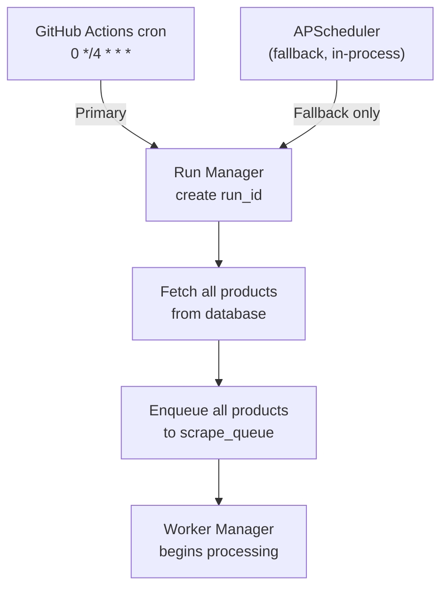
```mermaid
flowchart TD
    GHA["GitHub Actions cron\n0 */4 * * *"]
    APS["APScheduler\n(fallback, in-process)"]
    RunMgr["Run Manager\ncreate run_id"]
    FetchProducts["Fetch all products\nfrom database"]
    EnqueueAll["Enqueue all products\nto scrape_queue"]
    WorkerMgr["Worker Manager\nbegins processing"]

    GHA -->|"Primary"| RunMgr
    APS -->|"Fallback only"| RunMgr
    RunMgr --> FetchProducts
    FetchProducts --> EnqueueAll
    EnqueueAll --> WorkerMgr
```

**Failure handling:**
- If `FetchProducts` fails (database unreachable): run is marked `failed`, no jobs enqueued
- If `EnqueueAll` is interrupted: run is marked `partial`, jobs already enqueued continue processing
- If Worker Manager is not running: APScheduler restarts it before enqueuing

### 9.4 Worker Manager

**Responsibilities:**
- Spawn exactly `MAX_SCRAPER_WORKERS` (default: 3) scraper worker threads at startup
- Poll each thread's `is_alive()` every 30 seconds
- Restart any dead thread immediately with the same worker ID
- Maintain a thread registry (`dict[int, Thread]`) mapping worker ID to thread object
- Handle graceful shutdown: signal all workers to drain the queue before exiting

**Worker lifecycle:**

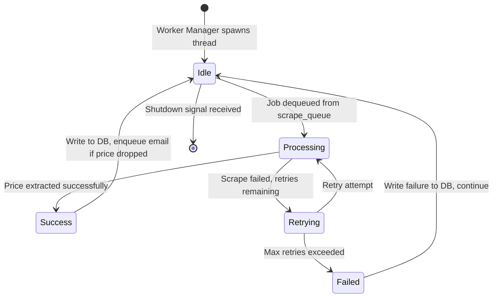
```mermaid
stateDiagram-v2
    [*] --> Idle : Worker Manager spawns thread
    Idle --> Processing : Job dequeued from scrape_queue
    Processing --> Success : Price extracted successfully
    Processing --> Retrying : Scrape failed, retries remaining
    Retrying --> Processing : Retry attempt
    Retrying --> Failed : Max retries exceeded
    Success --> Idle : Write to DB, enqueue email if price dropped
    Failed --> Idle : Write failure to DB, continue
    Idle --> [*] : Shutdown signal received
```

**Health monitoring:**
- Worker Manager runs its own daemon thread for health checks
- Health check interval: 30 seconds
- On crash detection: log warning with worker ID and restart reason, spawn replacement thread immediately

**Graceful shutdown:**
1. Receive SIGTERM (from Railway or OS)
2. Set `shutdown_event` flag
3. Workers finish current job, check flag, exit cleanly
4. Worker Manager waits up to 60 seconds for all workers to finish
5. Force-terminate any remaining workers after timeout

### 9.5 Scraper Worker

**Responsibilities:**
- Dequeue one scrape job from `scrape_queue`
- Launch a fresh browser context (not a new browser) for the job
- Navigate to the product URL, extract price and availability
- Write result to `price_history`
- If price dropped: update `products.current_price`, enqueue notification to `email_queue`
- Close browser context, return to idle

**Platform routing:**

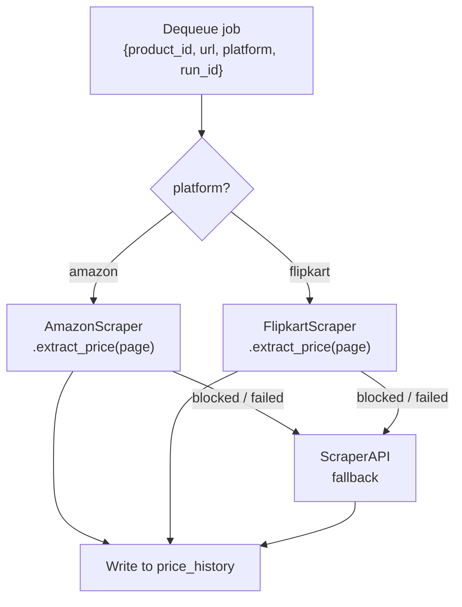
```mermaid
flowchart TD
    Job["Dequeue job\n{product_id, url, platform, run_id}"]
    Route{platform?}
    Amazon["AmazonScraper\n.extract_price(page)"]
    Flipkart["FlipkartScraper\n.extract_price(page)"]
    Fallback["ScraperAPI\nfallback"]
    Write["Write to price_history"]

    Job --> Route
    Route -->|"amazon"| Amazon
    Route -->|"flipkart"| Flipkart
    Amazon -->|"blocked / failed"| Fallback
    Flipkart -->|"blocked / failed"| Fallback
    Amazon --> Write
    Flipkart --> Write
    Fallback --> Write
```

**Retry strategy:**
- Max 3 attempts per product per run
- Backoff: 2s, 4s, 8s (exponential, base 2)
- On CAPTCHA / bot detection: mark `scrape_status = 'blocked'`, route to ScraperAPI fallback
- On persistent failure after fallback: mark `scrape_status = 'failed'`, move to next job

### 9.6 Notification Worker

**Responsibilities:**
- Dequeue one notification job from `email_queue`
- Query `subscriptions` to get all subscriber emails for the product
- Send one personalised email per subscriber via SendGrid
- Log delivery result (success or failure) per subscriber
- Retry failed deliveries up to 3 times with exponential backoff

**Email flow:**

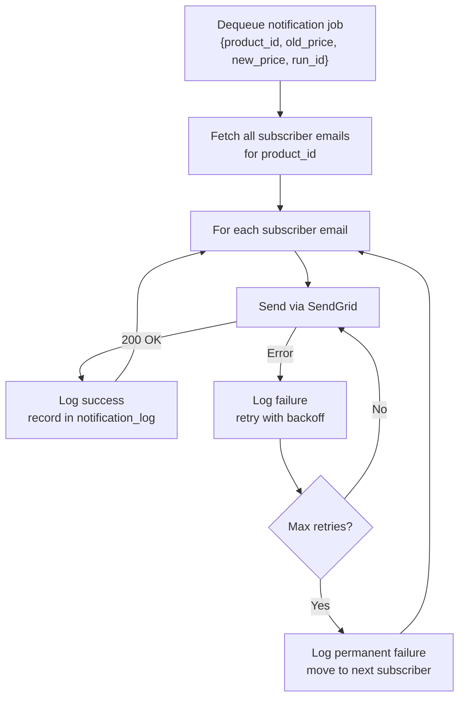
```mermaid
flowchart TD
    Dequeue["Dequeue notification job\n{product_id, old_price, new_price, run_id}"]
    Fetch["Fetch all subscriber emails\nfor product_id"]
    Loop["For each subscriber email"]
    Send["Send via SendGrid"]
    Success["Log success\nrecord in notification_log"]
    Fail["Log failure\nretry with backoff"]
    MaxRetry{Max retries?}
    GiveUp["Log permanent failure\nmove to next subscriber"]

    Dequeue --> Fetch
    Fetch --> Loop
    Loop --> Send
    Send -->|"200 OK"| Success
    Send -->|"Error"| Fail
    Fail --> MaxRetry
    MaxRetry -->|"No"| Send
    MaxRetry -->|"Yes"| GiveUp
    Success --> Loop
    GiveUp --> Loop
```

---

## 10. Sequence Diagrams

### 10.1 Add Product — Step 1: Preview

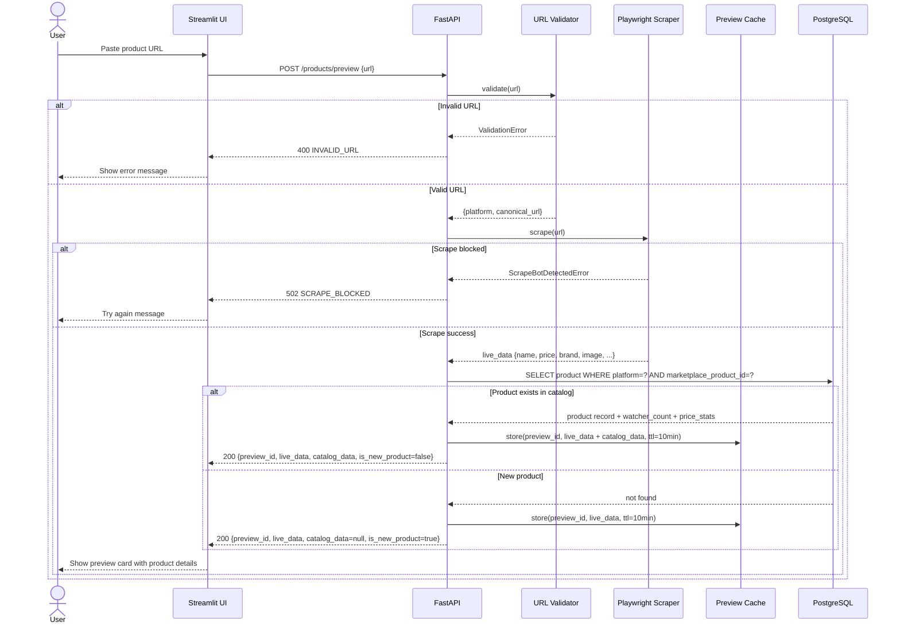
```mermaid
sequenceDiagram
    actor User
    participant UI as Streamlit UI
    participant API as FastAPI
    participant Validator as URL Validator
    participant Scraper as Playwright Scraper
    participant Cache as Preview Cache
    participant DB as PostgreSQL

    User->>UI: Paste product URL
    UI->>API: POST /products/preview {url}
    API->>Validator: validate(url)
    alt Invalid URL
        Validator-->>API: ValidationError
        API-->>UI: 400 INVALID_URL
        UI-->>User: Show error message
    else Valid URL
        Validator-->>API: {platform, canonical_url}
        API->>Scraper: scrape(url)
        alt Scrape blocked
            Scraper-->>API: ScrapeBotDetectedError
            API-->>UI: 502 SCRAPE_BLOCKED
            UI-->>User: Try again message
        else Scrape success
            Scraper-->>API: live_data {name, price, brand, image, ...}
            API->>DB: SELECT product WHERE platform=? AND marketplace_product_id=?
            alt Product exists in catalog
                DB-->>API: product record + watcher_count + price_stats
                API->>Cache: store(preview_id, live_data + catalog_data, ttl=10min)
                API-->>UI: 200 {preview_id, live_data, catalog_data, is_new_product=false}
            else New product
                DB-->>API: not found
                API->>Cache: store(preview_id, live_data, ttl=10min)
                API-->>UI: 200 {preview_id, live_data, catalog_data=null, is_new_product=true}
            end
            UI-->>User: Show preview card with product details
        end
    end
```

### 10.2 Add Product — Step 2: Confirm Subscription

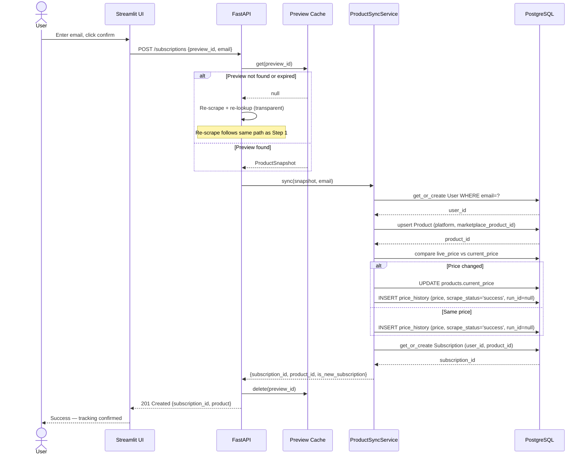
```mermaid
sequenceDiagram
    actor User
    participant UI as Streamlit UI
    participant API as FastAPI
    participant Cache as Preview Cache
    participant Sync as ProductSyncService
    participant DB as PostgreSQL

    User->>UI: Enter email, click confirm
    UI->>API: POST /subscriptions {preview_id, email}
    API->>Cache: get(preview_id)
    alt Preview not found or expired
        Cache-->>API: null
        API->>API: Re-scrape + re-lookup (transparent)
        Note over API: Re-scrape follows same path as Step 1
    else Preview found
        Cache-->>API: ProductSnapshot
    end
    API->>Sync: sync(snapshot, email)
    Sync->>DB: get_or_create User WHERE email=?
    DB-->>Sync: user_id
    Sync->>DB: upsert Product (platform, marketplace_product_id)
    DB-->>Sync: product_id
    Sync->>DB: compare live_price vs current_price
    alt Price changed
        Sync->>DB: UPDATE products.current_price
        Sync->>DB: INSERT price_history (price, scrape_status='success', run_id=null)
    else Same price
        Sync->>DB: INSERT price_history (price, scrape_status='success', run_id=null)
    end
    Sync->>DB: get_or_create Subscription (user_id, product_id)
    DB-->>Sync: subscription_id
    Sync-->>API: {subscription_id, product_id, is_new_subscription}
    API->>Cache: delete(preview_id)
    API-->>UI: 201 Created {subscription_id, product}
    UI-->>User: Success — tracking confirmed
```

### 10.3 Scheduled Scraping Run

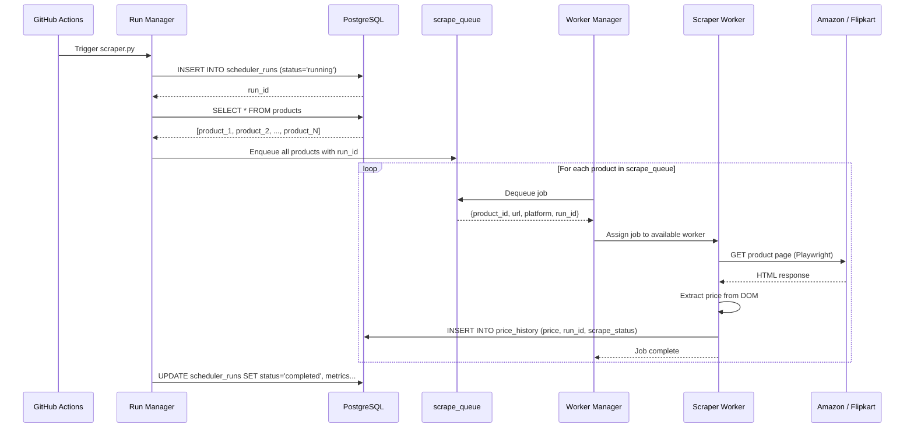
```mermaid
sequenceDiagram
    participant GHA as GitHub Actions
    participant RunMgr as Run Manager
    participant DB as PostgreSQL
    participant SQ as scrape_queue
    participant WM as Worker Manager
    participant W as Scraper Worker
    participant Site as Amazon / Flipkart

    GHA->>RunMgr: Trigger scraper.py
    RunMgr->>DB: INSERT INTO scheduler_runs (status='running')
    DB-->>RunMgr: run_id
    RunMgr->>DB: SELECT * FROM products
    DB-->>RunMgr: [product_1, product_2, ..., product_N]
    RunMgr->>SQ: Enqueue all products with run_id
    loop For each product in scrape_queue
        WM->>SQ: Dequeue job
        SQ-->>WM: {product_id, url, platform, run_id}
        WM->>W: Assign job to available worker
        W->>Site: GET product page (Playwright)
        Site-->>W: HTML response
        W->>W: Extract price from DOM
        W->>DB: INSERT INTO price_history (price, run_id, scrape_status)
        W-->>WM: Job complete
    end
    RunMgr->>DB: UPDATE scheduler_runs SET status='completed', metrics...
```

### 10.4 Price Drop Notification

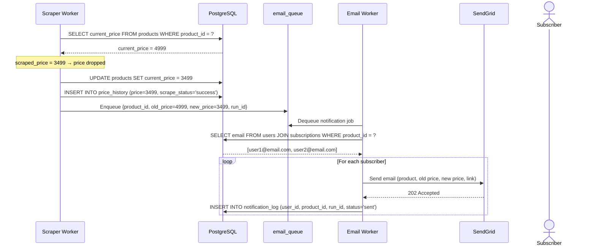
```mermaid
sequenceDiagram
    participant W as Scraper Worker
    participant DB as PostgreSQL
    participant EQ as email_queue
    participant EW as Email Worker
    participant SG as SendGrid
    actor Subscriber

    W->>DB: SELECT current_price FROM products WHERE product_id = ?
    DB-->>W: current_price = 4999
    Note over W: scraped_price = 3499 → price dropped
    W->>DB: UPDATE products SET current_price = 3499
    W->>DB: INSERT INTO price_history (price=3499, scrape_status='success')
    W->>EQ: Enqueue {product_id, old_price=4999, new_price=3499, run_id}
    EW->>EQ: Dequeue notification job
    EW->>DB: SELECT email FROM users JOIN subscriptions WHERE product_id = ?
    DB-->>EW: [user1@email.com, user2@email.com]
    loop For each subscriber
        EW->>SG: Send email (product, old price, new price, link)
        SG-->>EW: 202 Accepted
        EW->>DB: INSERT INTO notification_log (user_id, product_id, run_id, status='sent')
    end
```

### 10.5 Delete Subscription

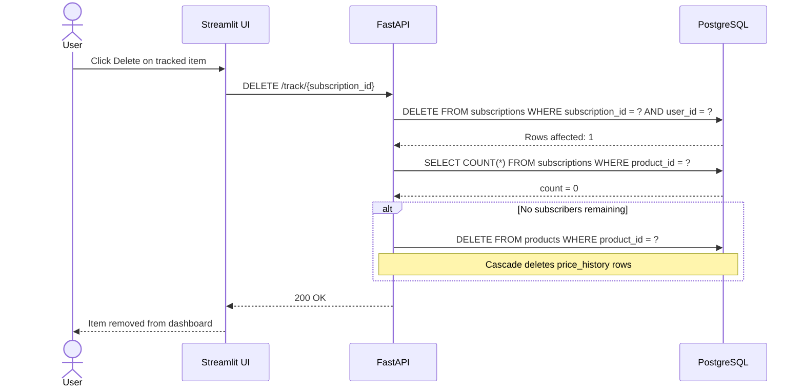
```mermaid
sequenceDiagram
    actor User
    participant UI as Streamlit UI
    participant API as FastAPI
    participant DB as PostgreSQL

    User->>UI: Click Delete on tracked item
    UI->>API: DELETE /track/{subscription_id}
    API->>DB: DELETE FROM subscriptions WHERE subscription_id = ? AND user_id = ?
    DB-->>API: Rows affected: 1
    API->>DB: SELECT COUNT(*) FROM subscriptions WHERE product_id = ?
    DB-->>API: count = 0
    alt No subscribers remaining
        API->>DB: DELETE FROM products WHERE product_id = ?
        Note over API,DB: Cascade deletes price_history rows
    end
    API-->>UI: 200 OK
    UI-->>User: Item removed from dashboard
```

---

## 11. Database Design

### 11.1 Overview

Five tables. All primary keys are UUID to avoid sequential ID enumeration. The core structure is a many-to-many relationship between `users` and `products` through `subscriptions`. The `price_history` and `scheduler_runs` tables provide the observability and audit trail.

### 11.2 Table: users

**Description:** Stores user identity. In MVP, a user is identified by email only. Phone is reserved for Phase 6 (SMS notifications).

| Column | Type | Constraints | Notes |
|---|---|---|---|
| `user_id` | UUID | PRIMARY KEY | Auto-generated (`gen_random_uuid()`) |
| `email` | VARCHAR(255) | UNIQUE, NOT NULL | Case-insensitive lookup — store lowercase |
| `phone` | VARCHAR(20) | NULLABLE | Reserved for SMS (Phase 6) |
| `created_at` | TIMESTAMP WITH TIME ZONE | DEFAULT now() | UTC |

**Indexes:**
- `idx_users_email` on `email` — supports dashboard lookup by email

### 11.3 Table: products

**Description:** One row per unique product. Deduplication is keyed on `(platform, marketplace_product_id)` — this catches the same product submitted via different URL forms (e.g. `amazon.in/dp/B0CHX1W1XY` and `amazon.in/SomeProduct/dp/B0CHX1W1XY` resolve to the same ASIN). The canonical URL unique constraint provides a secondary guard. Scraping is keyed on this table — one row means one scrape job per cycle.

| Column | Type | Constraints | Notes |
|---|---|---|---|
| `product_id` | UUID | PRIMARY KEY | Auto-generated |
| `url` | TEXT | UNIQUE, NOT NULL | Normalised (tracking params stripped) |
| `platform` | VARCHAR(50) | NOT NULL | `'amazon'` or `'flipkart'` |
| `marketplace_product_id` | VARCHAR(100) | NOT NULL | ASIN for Amazon, PID for Flipkart — primary deduplication key |
| `name` | TEXT | | Scraped and updated on every subscription confirm |
| `brand` | VARCHAR(255) | NULLABLE | Scraped — null if not on page |
| `image_url` | TEXT | | Scraped and updated on every subscription confirm |
| `current_price` | DECIMAL(10,2) | NULLABLE | NULL until first scrape; updated on every scrape or subscription confirm |
| `currency` | VARCHAR(10) | DEFAULT `'INR'` | |
| `availability` | BOOLEAN | | `true` = in stock |
| `rating` | DECIMAL(3,1) | NULLABLE | Star rating — null if not on page |
| `review_count` | INTEGER | NULLABLE | Number of reviews — null if not on page |
| `seller` | VARCHAR(255) | NULLABLE | Seller name — null if not on page |
| `last_checked_at` | TIMESTAMP WITH TIME ZONE | NULLABLE | Updated every successful scrape |
| `created_at` | TIMESTAMP WITH TIME ZONE | DEFAULT now() | |

**Indexes:**
- `idx_products_url` on `url` — secondary deduplication guard
- `idx_products_platform` on `platform` — supports platform-filtered queries
- `idx_products_platform_marketplace_id` on `(platform, marketplace_product_id)` — primary deduplication lookup

**Unique constraints:**
- `uq_products_url` on `url`
- `uq_products_platform_marketplace_id` on `(platform, marketplace_product_id)`

### 11.4 Table: subscriptions

**Description:** Join table linking users to products. Each row represents one user tracking one product. The unique constraint prevents duplicate subscriptions.

| Column | Type | Constraints | Notes |
|---|---|---|---|
| `subscription_id` | UUID | PRIMARY KEY | Auto-generated |
| `user_id` | UUID | NOT NULL, FK → `users.user_id` | CASCADE DELETE |
| `product_id` | UUID | NOT NULL, FK → `products.product_id` | |
| `created_at` | TIMESTAMP WITH TIME ZONE | DEFAULT now() | |
| — | — | UNIQUE (`user_id`, `product_id`) | Prevents duplicate subscriptions |

**Indexes:**
- Composite unique index on `(user_id, product_id)` — enforces deduplication, also supports lookup by either column
- `idx_subscriptions_product_id` on `product_id` — supports fan-out query (find all subscribers for a product)

### 11.5 Table: price_history

**Description:** Append-only log of every scrape attempt. Records success and failure. Will power Phase 2 price history charts. Linked to `scheduler_runs` via `run_id` for complete traceability. `run_id` is nullable — rows written at subscription time (from the preview scrape) have no associated scheduler run.

| Column | Type | Constraints | Notes |
|---|---|---|---|
| `history_id` | UUID | PRIMARY KEY | Auto-generated |
| `product_id` | UUID | NOT NULL, FK → `products.product_id` | CASCADE DELETE |
| `run_id` | UUID | NULLABLE, FK → `scheduler_runs.run_id` | NULL for subscription-time writes; set for scheduler-run writes |
| `price` | DECIMAL(10,2) | NULLABLE | NULL if `scrape_status != 'success'` |
| `scrape_status` | VARCHAR(20) | NOT NULL | `'success'`, `'failed'`, `'blocked'` |
| `checked_at` | TIMESTAMP WITH TIME ZONE | DEFAULT now() | |

**Indexes:**
- `idx_price_history_product_id` on `product_id` — supports price chart queries (Phase 2)
- `idx_price_history_run_id` on `run_id` — supports run diagnostics

### 11.6 Table: notification_log

**Description:** Records every email notification attempt. Enables deduplication (avoid re-sending within a cooldown period in Phase 3) and delivery diagnostics.

| Column | Type | Constraints | Notes |
|---|---|---|---|
| `notification_id` | UUID | PRIMARY KEY | Auto-generated |
| `user_id` | UUID | NOT NULL, FK → `users.user_id` | |
| `product_id` | UUID | NOT NULL, FK → `products.product_id` | |
| `run_id` | UUID | NOT NULL, FK → `scheduler_runs.run_id` | |
| `old_price` | DECIMAL(10,2) | NOT NULL | Price before drop |
| `new_price` | DECIMAL(10,2) | NOT NULL | Price after drop |
| `status` | VARCHAR(20) | NOT NULL | `'sent'`, `'failed'`, `'skipped'` |
| `sent_at` | TIMESTAMP WITH TIME ZONE | DEFAULT now() | |

**Indexes:**
- `idx_notification_log_user_product` on `(user_id, product_id, sent_at)` — supports cooldown check (Phase 3)

### 11.7 Table: scheduler_runs

**Description:** One row per scheduled execution. Created at the start of each run, updated at the end. The primary operational visibility instrument.

| Column | Type | Constraints | Notes |
|---|---|---|---|
| `run_id` | UUID | PRIMARY KEY | Created at run start, propagated to all jobs |
| `started_at` | TIMESTAMP WITH TIME ZONE | NOT NULL | |
| `completed_at` | TIMESTAMP WITH TIME ZONE | NULLABLE | NULL while `status = 'running'` |
| `status` | VARCHAR(20) | NOT NULL | `'running'`, `'completed'`, `'partial'`, `'failed'` |
| `products_total` | INTEGER | | All products enqueued |
| `products_scraped` | INTEGER | | Successfully scraped |
| `products_failed` | INTEGER | | Failed after max retries |
| `price_drops_found` | INTEGER | | Drops detected this run |
| `emails_sent` | INTEGER | | Notifications dispatched |

**Status definitions:**

| Status | Meaning | Action |
|---|---|---|
| `running` | Run in progress | Normal |
| `completed` | All products scraped with no failures | No action |
| `partial` | One or more products failed after retries | Query `price_history` for `scrape_status != 'success'` |
| `failed` | Run could not start (e.g. DB unreachable) | Investigate infrastructure |

---

## 12. Entity Relationship Diagram

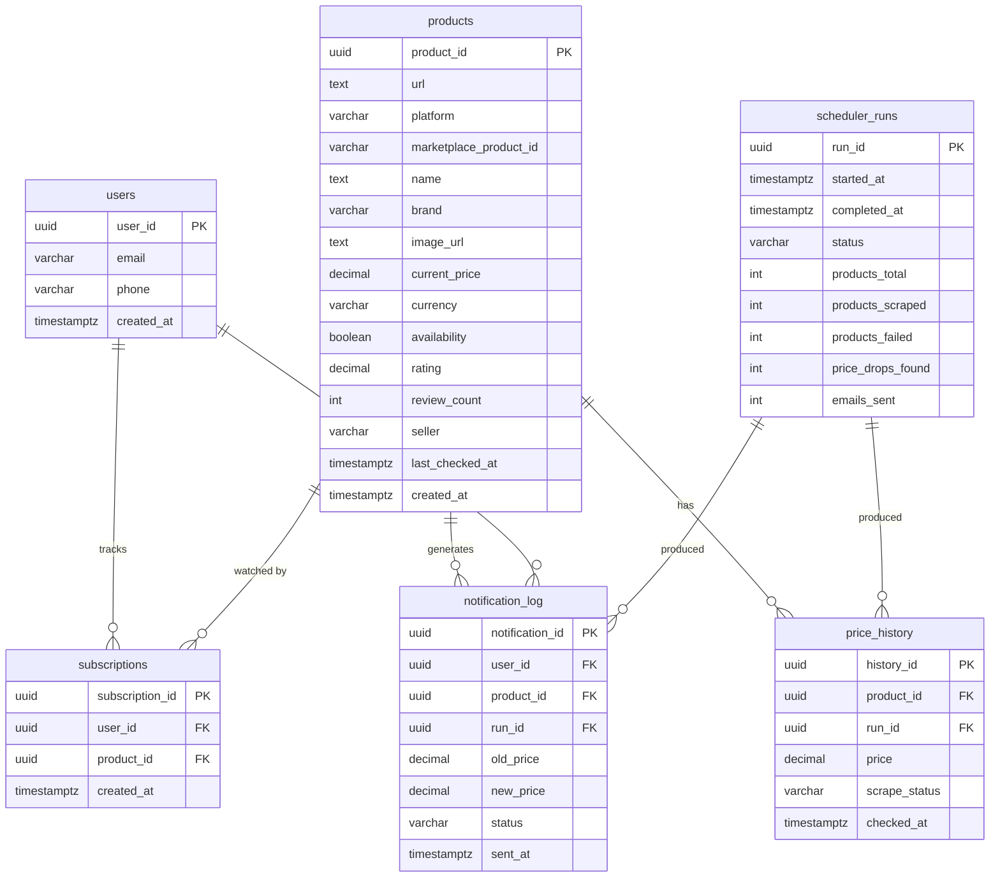
```mermaid
erDiagram
    users {
        uuid user_id PK
        varchar email
        varchar phone
        timestamptz created_at
    }

    products {
        uuid product_id PK
        text url
        varchar platform
        varchar marketplace_product_id
        text name
        varchar brand
        text image_url
        decimal current_price
        varchar currency
        boolean availability
        decimal rating
        int review_count
        varchar seller
        timestamptz last_checked_at
        timestamptz created_at
    }

    subscriptions {
        uuid subscription_id PK
        uuid user_id FK
        uuid product_id FK
        timestamptz created_at
    }

    price_history {
        uuid history_id PK
        uuid product_id FK
        uuid run_id FK
        decimal price
        varchar scrape_status
        timestamptz checked_at
    }

    notification_log {
        uuid notification_id PK
        uuid user_id FK
        uuid product_id FK
        uuid run_id FK
        decimal old_price
        decimal new_price
        varchar status
        timestamptz sent_at
    }

    scheduler_runs {
        uuid run_id PK
        timestamptz started_at
        timestamptz completed_at
        varchar status
        int products_total
        int products_scraped
        int products_failed
        int price_drops_found
        int emails_sent
    }

    users ||--o{ subscriptions : "tracks"
    products ||--o{ subscriptions : "watched by"
    products ||--o{ price_history : "has"
    products ||--o{ notification_log : "generates"
    users ||--o{ notification_log : "receives"
    scheduler_runs ||--o{ price_history : "produced"
    scheduler_runs ||--o{ notification_log : "produced"
```

---

## 13. Queue Design

### 13.1 Overview

Two in-memory queues decouple the three phases of processing: scheduling, scraping, and notification. Using Python's `queue.Queue` (stdlib, thread-safe) eliminates external dependencies at MVP scale.

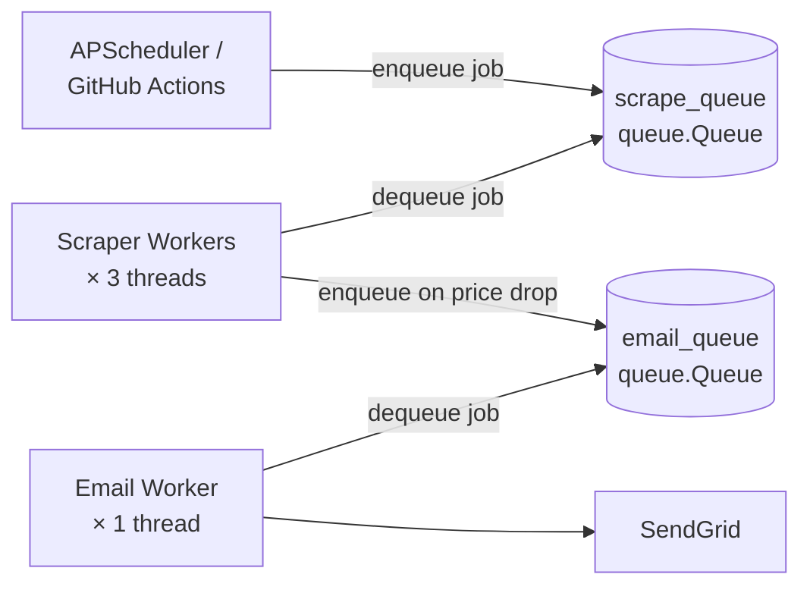
```mermaid
flowchart LR
    Scheduler["APScheduler /\nGitHub Actions"]
    SQ[("scrape_queue\nqueue.Queue")]
    Workers["Scraper Workers\n× 3 threads"]
    EQ[("email_queue\nqueue.Queue")]
    EWorker["Email Worker\n× 1 thread"]
    SG["SendGrid"]

    Scheduler -->|"enqueue job"| SQ
    Workers -->|"dequeue job"| SQ
    Workers -->|"enqueue on price drop"| EQ
    EWorker -->|"dequeue job"| EQ
    EWorker --> SG
```

### 13.2 Scrape Queue

**Type:** `queue.Queue` (unbounded)

**Producer:** APScheduler / GitHub Actions trigger — enqueues one job per product per run

**Consumers:** Scraper Worker threads (3 consumers)

**Job schema:**
```json
{
  "product_id": "uuid",
  "url": "https://www.amazon.in/...",
  "platform": "amazon",
  "run_id": "uuid"
}
```

**Behaviour:**
- Workers call `queue.get(block=True)` — they block until a job is available
- On shutdown: sentinel `None` values are enqueued (one per worker) to unblock workers

### 13.3 Notification Queue

**Type:** `queue.Queue` (unbounded)

**Producer:** Scraper Workers — enqueue one job per price drop event

**Consumer:** Email Worker (1 consumer)

**Job schema:**
```json
{
  "product_id": "uuid",
  "product_name": "Samsung Galaxy S24",
  "product_image_url": "https://...",
  "product_url": "https://www.amazon.in/...",
  "old_price": 79999.00,
  "new_price": 69999.00,
  "run_id": "uuid"
}
```

**Subscriber list:** The email worker fetches subscriber emails from the database at send time (not stored in the queue job) — this ensures the list is always current.

### 13.4 Queue Upgrade Path

When `queue.Queue` is no longer sufficient (high product volume, multi-process workers, or persistence across restarts):

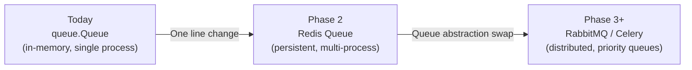
```mermaid
flowchart LR
    Today["Today\nqueue.Queue\n(in-memory, single process)"]
    Redis["Phase 2\nRedis Queue\n(persistent, multi-process)"]
    RMQ["Phase 3+\nRabbitMQ / Celery\n(distributed, priority queues)"]

    Today -->|"One line change"| Redis
    Redis -->|"Queue abstraction swap"| RMQ
```

The only code change required for the Redis upgrade:
```python
# Before
scrape_queue = queue.Queue()

# After
scrape_queue = RedisQueue(host=REDIS_HOST, name="scrape_queue")
```

All worker logic remains identical because workers interact with the queue through `get()` and `put()` only.

### 13.5 Job Lifecycle

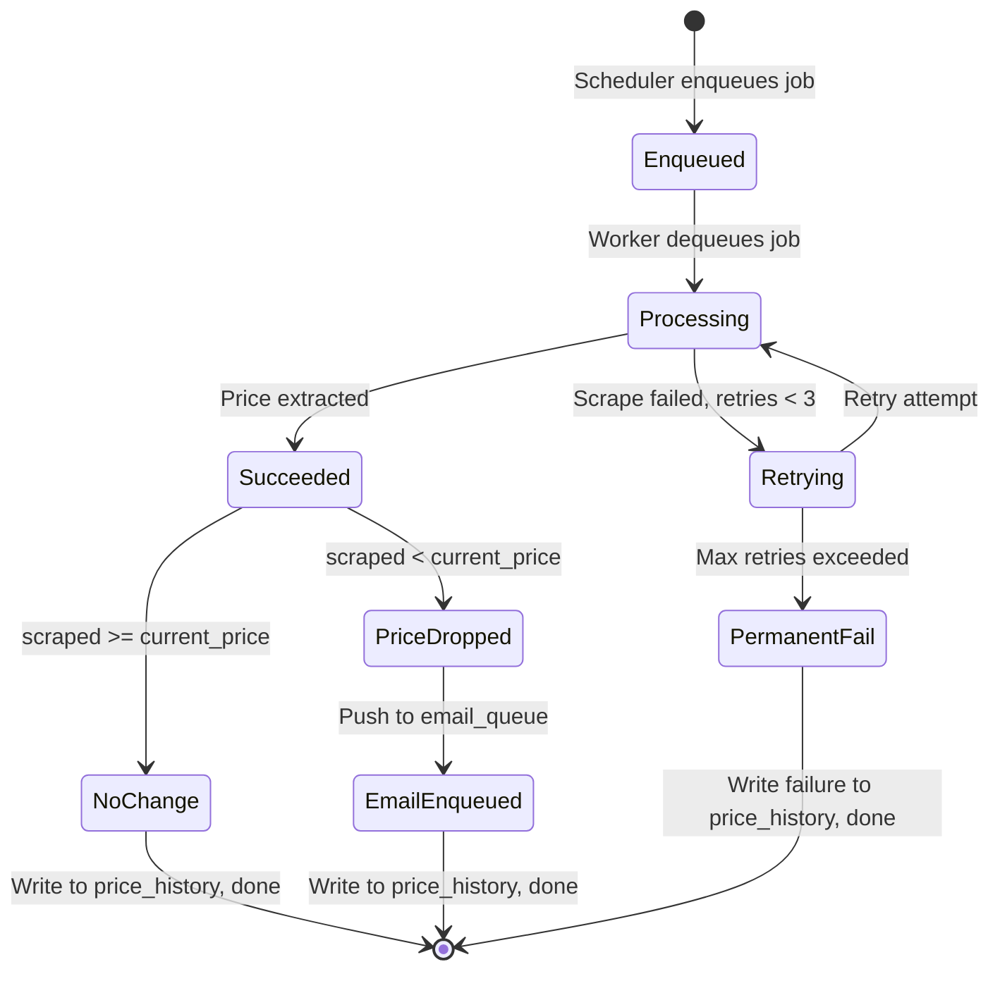
```mermaid
stateDiagram-v2
    [*] --> Enqueued : Scheduler enqueues job
    Enqueued --> Processing : Worker dequeues job
    Processing --> Succeeded : Price extracted
    Processing --> Retrying : Scrape failed, retries < 3
    Retrying --> Processing : Retry attempt
    Retrying --> PermanentFail : Max retries exceeded
    Succeeded --> PriceDropped : scraped < current_price
    Succeeded --> NoChange : scraped >= current_price
    PriceDropped --> EmailEnqueued : Push to email_queue
    NoChange --> [*] : Write to price_history, done
    EmailEnqueued --> [*] : Write to price_history, done
    PermanentFail --> [*] : Write failure to price_history, done
```

---

## 14. Worker Architecture

### 14.1 Worker Manager

The Worker Manager is a supervisor that owns the lifecycle of all scraper worker threads. It is the only component that creates, monitors, and restarts workers.

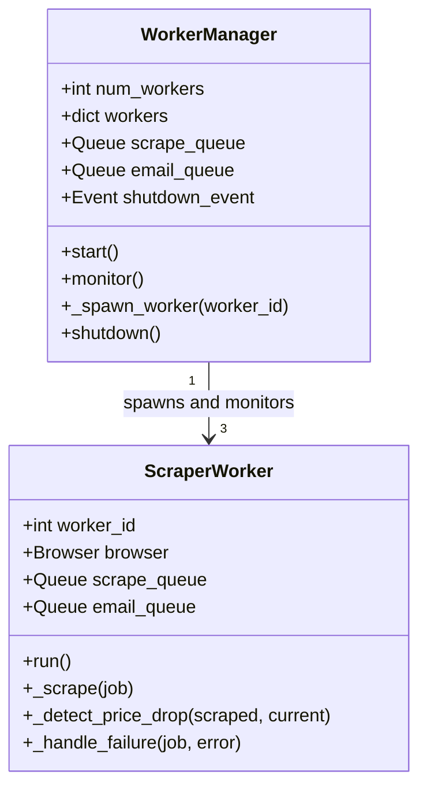
```mermaid
classDiagram
    class WorkerManager {
        +int num_workers
        +dict workers
        +Queue scrape_queue
        +Queue email_queue
        +Event shutdown_event
        +start()
        +monitor()
        +_spawn_worker(worker_id)
        +shutdown()
    }

    class ScraperWorker {
        +int worker_id
        +Browser browser
        +Queue scrape_queue
        +Queue email_queue
        +run()
        +_scrape(job)
        +_detect_price_drop(scraped, current)
        +_handle_failure(job, error)
    }

    WorkerManager "1" --> "3" ScraperWorker : spawns and monitors
```

### 14.2 Thread Model

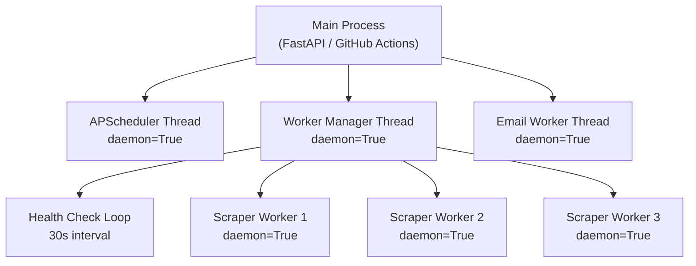
```mermaid
flowchart TD
    MainProcess["Main Process\n(FastAPI / GitHub Actions)"]
    APSThread["APScheduler Thread\ndaemon=True"]
    WMThread["Worker Manager Thread\ndaemon=True"]
    HC["Health Check Loop\n30s interval"]
    W1["Scraper Worker 1\ndaemon=True"]
    W2["Scraper Worker 2\ndaemon=True"]
    W3["Scraper Worker 3\ndaemon=True"]
    EWThread["Email Worker Thread\ndaemon=True"]

    MainProcess --> APSThread
    MainProcess --> WMThread
    MainProcess --> EWThread
    WMThread --> HC
    WMThread --> W1
    WMThread --> W2
    WMThread --> W3
```

All worker threads are daemon threads. They exit automatically if the main process exits, preventing orphaned processes.

### 14.3 Graceful Shutdown

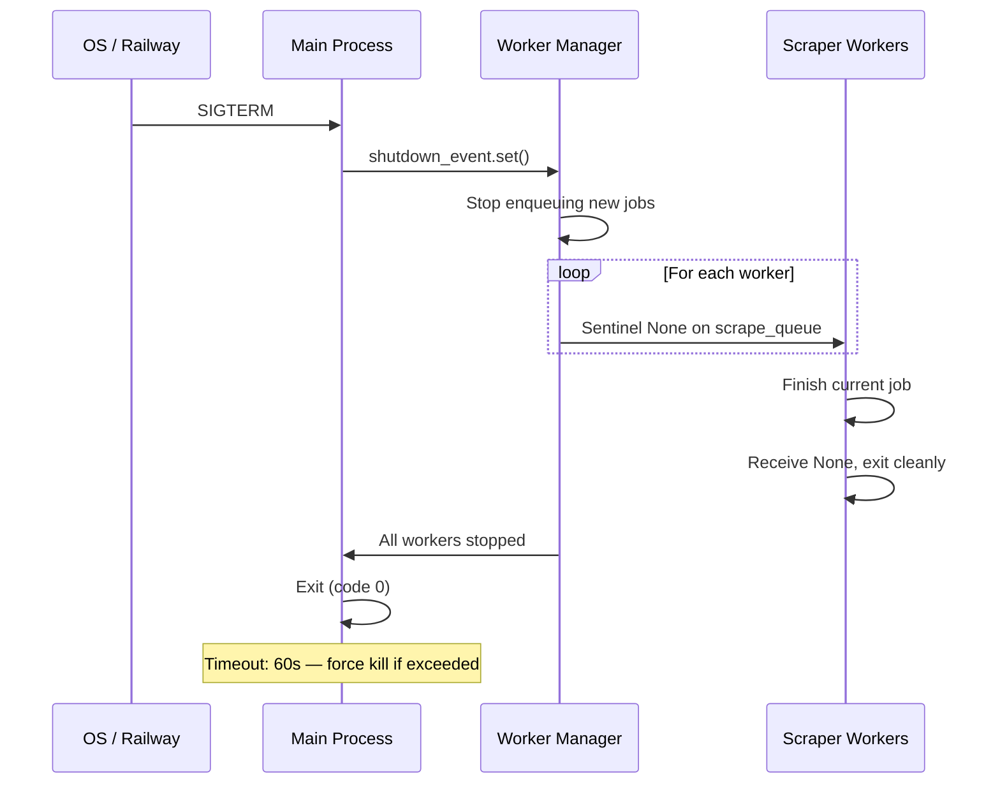
```mermaid
sequenceDiagram
    participant OS as OS / Railway
    participant Main as Main Process
    participant WM as Worker Manager
    participant W as Scraper Workers

    OS->>Main: SIGTERM
    Main->>WM: shutdown_event.set()
    WM->>WM: Stop enqueuing new jobs
    loop For each worker
        WM->>W: Sentinel None on scrape_queue
    end
    W->>W: Finish current job
    W->>W: Receive None, exit cleanly
    WM->>Main: All workers stopped
    Main->>Main: Exit (code 0)
    Note over Main: Timeout: 60s — force kill if exceeded
```

### 14.4 Future Distributed Workers

The current thread-based model can be replaced with distributed workers (e.g. Celery workers on separate machines) by swapping the queue backend and the worker execution model. The business logic inside each worker — price comparison, database writes, notification enqueuing — remains unchanged.

---

## 15. Playwright Design

### 15.1 Browser Lifecycle

```mermaid
flowchart TD
    Start["Worker thread starts"]
    Launch["playwright.chromium.launch()\nheadless=True\nstealth=True"]
    Idle["Browser idle\nwaiting for job"]
    NewContext["browser.new_context()\nfresh cookies, cache, viewport"]
    NewPage["context.new_page()"]
    Navigate["page.goto(url, timeout=30s)"]
    Extract["Extract price\nfrom DOM"]
    CloseContext["context.close()\nrelease memory"]
    NextJob["Next job from queue"]
    Shutdown["browser.close()\nPlaywright stop"]

    Start --> Launch
    Launch --> Idle
    Idle --> NewContext
    NewContext --> NewPage
    NewPage --> Navigate
    Navigate --> Extract
    Extract --> CloseContext
    CloseContext --> NextJob
    NextJob --> Idle
    Idle --> Shutdown
```

### 15.2 Browser vs Context vs Page

| Object | Created | Destroyed | Memory | Purpose |
|---|---|---|---|---|
| `Browser` | Once per worker at startup | When worker shuts down | ~150–250 MB | Chromium process |
| `BrowserContext` | Once per scrape job | After each job completes | ~10–20 MB | Isolated session (cookies, cache, storage) |
| `Page` | Once per context | With context | ~5 MB | Single tab / navigation |

**Key principle:** Never create a new `Browser` per job. Always reuse the `Browser`, create a fresh `BrowserContext` per job.

### 15.3 Memory Considerations

| Workers | Browser RAM | Context RAM (peak) | Total |
|---|---|---|---|
| 3 (default) | ~600 MB | ~60 MB | ~660 MB |
| 5 | ~1,000 MB | ~100 MB | ~1,100 MB |
| 10 | ~2,000 MB | ~200 MB | ~2,200 MB |

GitHub Actions runner has 7 GB RAM. Default pool of 3 workers uses less than 10% of available RAM.

### 15.4 Timeout Configuration

| Operation | Timeout | On timeout |
|---|---|---|
| `page.goto()` | 30 seconds | Retry |
| `page.wait_for_selector()` | 10 seconds | Mark as failed |
| Full scrape per product | 60 seconds | Force kill context, mark as failed |

### 15.5 playwright-stealth Configuration

playwright-stealth patches the following browser properties to reduce bot detection:

- `navigator.webdriver` → removed
- `navigator.plugins` → populated with realistic values
- `navigator.languages` → `['en-IN', 'en']`
- Chrome runtime → mocked
- WebGL vendor/renderer → realistic GPU strings
- User-Agent → latest Chrome on Windows 10

---

## 16. API Design Overview

### 16.1 REST Conventions

- Base URL: `https://api.pricemonitor.app/v1`
- All responses: `Content-Type: application/json`
- All timestamps: ISO 8601 UTC (`2026-07-14T10:30:00Z`)
- All IDs: UUID string
- Errors: consistent error envelope (see Section 16.5)

### 16.2 Authentication Strategy (MVP)

No authentication in MVP. The user's email address is the identifier. This is an intentional MVP compromise — see [ADR-009](#adr-009-no-authentication-in-mvp).

Phase 7 will introduce JWT-based authentication. The endpoint structure is designed to accommodate this: all user-scoped endpoints accept `email` as a query parameter in MVP, which will be replaced by the JWT subject claim in Phase 7.

### 16.3 Endpoint Overview

| Method | Path | Description |
|---|---|---|
| `POST` | `/track` | Add a product to track |
| `GET` | `/items` | Get all tracked items for an email |
| `DELETE` | `/track/{subscription_id}` | Remove a tracked item |
| `GET` | `/products/{product_id}` | Get product details |
| `GET` | `/health` | Health check (Railway uptime probe) |
| `GET` | `/runs` | List recent scheduler runs (admin) |
| `GET` | `/runs/{run_id}` | Get run details (admin) |

> Full request/response schemas, validation rules, and HTTP status codes are defined in the API Specification document.

### 16.4 Versioning Strategy

All endpoints are prefixed with `/v1`. Breaking changes will introduce `/v2`. The Streamlit UI will pin to a specific version prefix, ensuring UI updates and API updates can be deployed independently.

### 16.5 Error Response Format

All errors return a consistent JSON envelope:

```json
{
  "error": {
    "code": "INVALID_URL",
    "message": "The submitted URL is not a supported product page.",
    "detail": "Supported platforms: Amazon India, Flipkart"
  }
}
```

### 16.6 Internal API

The APScheduler fallback trigger calls an internal endpoint to initiate a scrape run:

| Method | Path | Auth | Description |
|---|---|---|---|
| `POST` | `/internal/trigger-run` | Bearer token (`SECRET_KEY`) | Triggers a scrape run manually |

This endpoint is not exposed publicly and is protected by the `SECRET_KEY` environment variable.

---

## 17. Security Design

### 17.1 Secrets Management

All secrets are stored as environment variables. They are never committed to the source repository.

| Secret | Storage location | Rotation |
|---|---|---|
| `DATABASE_URL` | Railway env, GitHub Actions secrets | On credential compromise |
| `SENDGRID_API_KEY` | Railway env, GitHub Actions secrets | Quarterly or on compromise |
| `SCRAPER_API_KEY` | GitHub Actions secrets | On credential compromise |
| `SECRET_KEY` | Railway env | On credential compromise |

### 17.2 SQL Injection Prevention

All database queries use SQLAlchemy parameterised statements. Raw SQL strings with user input are never used.

```python
# Safe — parameterised
db.execute(select(Product).where(Product.url == url))

# Never — string interpolation
db.execute(f"SELECT * FROM products WHERE url = '{url}'")
```

### 17.3 URL Validation

User-submitted URLs are validated before any database operation or scrape:

1. Must match an allowed domain (`amazon.in`, `flipkart.com`)
2. Must match a known product page URL pattern
3. Tracking parameters are stripped before storage (canonical form)
4. Maximum URL length: 2,048 characters

### 17.4 Future Authentication (Phase 7)

Phase 7 will introduce email + password authentication with JWT tokens:

- Passwords hashed with `bcrypt`
- JWT signed with `SECRET_KEY`, 24-hour expiry
- Refresh tokens stored in `users` table (hashed)
- All user-scoped endpoints require `Authorization: Bearer <token>` header
- The email-based lookup pattern used in MVP is replaced by the JWT subject claim

### 17.5 Rate Limiting

Phase 3 will introduce rate limiting on `POST /track`:

- Maximum 10 products per email per day
- Maximum 50 products per email total
- Implemented via Redis-backed token bucket (no Redis in MVP — deferred)

---

## 18. Logging and Monitoring

### 18.1 Structured Logging

All components use Python's `logging` module with a JSON formatter in production:

```json
{
  "timestamp": "2026-07-14T10:30:00Z",
  "level": "INFO",
  "component": "scraper_worker",
  "worker_id": 1,
  "run_id": "uuid",
  "product_id": "uuid",
  "message": "Price extracted successfully",
  "price": 3499.00,
  "duration_ms": 4231
}
```

### 18.2 Log Levels by Event

| Event | Level |
|---|---|
| Scrape success | INFO |
| Price drop detected | INFO |
| Scrape failure (retrying) | WARNING |
| Scrape failure (permanent) | ERROR |
| Worker crash detected | ERROR |
| Worker restarted | WARNING |
| Run completed | INFO |
| Run partial (failures present) | WARNING |
| Database connection failure | CRITICAL |
| Email delivery failure | ERROR |

### 18.3 Operational Queries

**Last 10 runs:**
```sql
SELECT run_id, status, products_total, products_failed,
       price_drops_found, emails_sent, started_at
FROM scheduler_runs
ORDER BY started_at DESC
LIMIT 10;
```

**Failures in a specific run:**
```sql
SELECT p.url, ph.scrape_status, ph.checked_at
FROM price_history ph
JOIN products p USING (product_id)
WHERE ph.run_id = '<run_id>'
  AND ph.scrape_status != 'success';
```

**Notification delivery failures:**
```sql
SELECT u.email, p.name, nl.status, nl.sent_at
FROM notification_log nl
JOIN users u USING (user_id)
JOIN products p USING (product_id)
WHERE nl.status = 'failed'
ORDER BY nl.sent_at DESC;
```

### 18.4 Future Observability (Phase 3+)

- Export `scheduler_runs` metrics to Grafana via Prometheus exporter
- Sentry integration for exception tracking in FastAPI
- Uptime monitoring for Railway service via Better Uptime (free tier)
- Slack / Telegram alert on `status = 'failed'` run

---

## 19. Configuration Management

### 19.1 Configuration Classes

All configuration is loaded from environment variables via Pydantic `BaseSettings`:

```python
class Settings(BaseSettings):
    database_url: str
    sendgrid_api_key: str
    scraper_api_key: str
    secret_key: str
    max_scraper_workers: int = 3
    scrape_retry_limit: int = 3
    scrape_timeout_seconds: int = 60
    log_level: str = "INFO"

    class Config:
        env_file = ".env"          # local development only
        env_file_encoding = "utf-8"
```

### 19.2 Runtime Configuration

| Parameter | Default | Description |
|---|---|---|
| `max_scraper_workers` | 3 | Number of Playwright browser workers |
| `scrape_retry_limit` | 3 | Max retries per product per run |
| `scrape_timeout_seconds` | 60 | Max time per product scrape |
| `worker_health_check_interval` | 30 | Seconds between Worker Manager health checks |
| `email_retry_limit` | 3 | Max retries per email per notification job |
| `queue_drain_timeout` | 60 | Seconds to wait for queue drain on shutdown |

### 19.3 Local Development

A `.env` file (git-ignored) provides secrets for local development. A `.env.example` file (committed) documents all required variables with placeholder values.

---

## 20. Error Handling Strategy

### 20.1 Failure Categories

| Category | Examples | Strategy |
|---|---|---|
| Transient | Network timeout, temporary 503 | Retry with exponential backoff |
| Anti-bot | CAPTCHA, IP block, 429 | Fallback to ScraperAPI, mark as `blocked` |
| Permanent scraper | Price element not found, page structure changed | Mark as `failed`, alert team |
| Database | Connection refused, query timeout | Retry × 3, then fail run |
| Email | SendGrid 4xx | Retry × 3, then mark `notification_log.status = 'failed'` |
| Worker crash | Unhandled exception in thread | Worker Manager restarts thread within 30s |

### 20.2 Retry Configuration

```mermaid
flowchart TD
    Attempt["Attempt scrape"]
    Success["Success\n→ write to DB"]
    Fail["Failure"]
    Retry1{Attempt < 3?}
    Backoff["Backoff: 2^attempt seconds\n(2s, 4s, 8s)"]
    Blocked{Bot detected?}
    Fallback["ScraperAPI fallback"]
    Permanent["Mark failed\nwrite to price_history\nmove to next job"]

    Attempt --> Success
    Attempt --> Fail
    Fail --> Retry1
    Retry1 -->|Yes| Backoff
    Backoff --> Blocked
    Blocked -->|Yes| Fallback
    Blocked -->|No| Attempt
    Fallback --> Success
    Fallback --> Permanent
    Retry1 -->|No| Permanent
```

### 20.3 Database Failure Handling

- Connection lost mid-run: retry connection up to 3 times with 5s backoff
- If connection cannot be re-established: mark run as `failed`, exit scraper process
- SQLAlchemy connection pool handles transient connection drops transparently

### 20.4 Email Failure Handling

- SendGrid 4xx (bad request): log error, mark `notification_log.status = 'failed'`, do not retry
- SendGrid 5xx (server error): retry × 3 with backoff, then mark failed
- Subscriber email bounced: log, do not retry (Phase 3 will add bounce tracking)

---

## 21. Cost Optimisation

### 21.1 Monthly Cost Breakdown

| Service | Free tier | Usage | Cost |
|---|---|---|---|
| Railway (FastAPI) | None — $5/mo starter | Always-on API | ~$5/mo |
| Supabase (Postgres) | 500 MB, 2 projects | < 50 MB for MVP | Free |
| Streamlit Cloud | Unlimited public apps | 1 app | Free |
| GitHub Actions | 2,000 min/month (private) | ~30 min/day = 900 min/month | Free |
| SendGrid | 100 emails/day | MVP: < 50/day | Free |
| ScraperAPI | 1,000 req/month | Fallback only: < 100/month | Free |
| **Total** | | | **~$5/month** |

### 21.2 Why Not Kubernetes?

Kubernetes adds significant operational overhead: cluster management, node provisioning, pod scheduling, networking configuration, and monitoring. At MVP scale (< 500 products, 1 developer), this overhead is not justified. The current architecture achieves the same goal — isolated, restartable workers — using Python threads and a simple supervisor pattern.

### 21.3 Scaling Cost Projection

| Scale | Products | Users | Additional infrastructure | Estimated cost |
|---|---|---|---|---|
| MVP | < 500 | < 1,000 | None | ~$5/mo |
| Phase 2 | < 5,000 | < 10,000 | Redis (Upstash free tier) | ~$10/mo |
| Phase 3 | < 50,000 | < 100,000 | Dedicated scraper VM, Redis paid | ~$50/mo |
| Phase 4+ | 50,000+ | 100,000+ | Kubernetes, CDN, read replicas | ~$200+/mo |

---

## 22. Scalability Roadmap

### 22.1 When to Introduce Redis

**Trigger:** > 5,000 products tracked, or scraper run duration exceeds 3 hours.

**Change:** Replace `queue.Queue` with a Redis-backed queue (e.g. `rq` or a custom `RedisQueue` wrapper). No changes to worker logic — only the queue instantiation line changes.

### 22.2 When to Introduce Celery

**Trigger:** Need to distribute scraper workers across multiple machines, or need task prioritisation (premium users scraped more frequently).

**Change:** Replace the Worker Manager + thread pool with Celery workers. FastAPI enqueues Celery tasks instead of putting items on a `queue.Queue`. Celery workers are deployed as separate Railway services.

### 22.3 When to Introduce Multiple FastAPI Instances

**Trigger:** API response time degrades under load, or Railway service restarts cause user-visible downtime.

**Change:** Add Railway's built-in horizontal scaling (multiple replicas). APScheduler must be disabled in all but one replica to prevent duplicate scrape triggers — replace with a dedicated scheduler service.

### 22.4 When to Introduce Read Replicas

**Trigger:** Dashboard query latency > 200ms, database CPU > 80% during scrape runs.

**Change:** Supabase supports read replicas. Route all `SELECT` queries (dashboard, subscription lookups) to the read replica, all `INSERT`/`UPDATE` queries to the primary.

### 22.5 Full Scalability Path

```mermaid
flowchart TD
    MVP["MVP\nqueue.Queue\nAPScheduler\nSingle FastAPI\nSupabase free"]
    Phase2["Phase 2\nRedis Queue\nCelery workers\nMultiple scrapers"]
    Phase3["Phase 3\nMultiple FastAPI replicas\nDedicated scheduler service\nSupabase paid + read replicas"]
    Phase4["Phase 4+\nKubernetes\nCDN\nElasticsearch\nFull observability stack"]

    MVP -->|"5,000+ products"| Phase2
    Phase2 -->|"50,000+ products"| Phase3
    Phase3 -->|"500,000+ products"| Phase4
```

---

## 23. Future Enhancements

### Phase 2 — Better Tracking

- Price history chart (line chart, daily / weekly / monthly view) — `price_history` table already populated
- All-time low and all-time high badges — derived from `price_history`
- Manual refresh button with rate limiting (max 1 per hour per product)
- Search, sort, and filter on dashboard

### Phase 3 — Smarter Alerts

- Target price alert: notify when price hits ₹X (new column on `subscriptions`)
- Percentage drop alert: notify only if price drops by ≥ N% (new column on `subscriptions`)
- Notification cooldown: max one email per 24 hours per product per user (`notification_log` already supports this query)
- In-app notification history

### Phase 4 — Offers and Discounts

- Card discount scraping: raw text extracted and stored
- Structured discount fields: card name, discount type, amount, cap
- Coupon codes, cashback, EMI options
- Effective price calculation (price after best available discount)

### Phase 5 — More Platforms

- Croma, Reliance Digital, Myntra, Apple Store India, Samsung Store India
- Platform-agnostic scraper interface — adding a platform means implementing `extract_price(page)` only

### Phase 6 — More Notification Channels

- SMS via Twilio
- WhatsApp via Twilio WhatsApp API
- Telegram via Bot API
- Browser push notifications
- Each channel is a new worker consuming the same `email_queue` (or a renamed `notification_queue`)

### Phase 7 — Advanced Features

- User registration and login (email + password, JWT)
- Admin role: view all runs, all products, all subscribers
- Sale prediction ("Buy now" vs "Wait") using linear regression on `price_history`
- Cross-platform price comparison
- Shareable watchlist link
- Export price history (CSV / Excel)
- Browser extension (polls `/items` endpoint)
- Mobile app (Android / iOS) using the same REST API
- Daily / weekly price digest email
- REST API for third-party integrations

---

## 24. Design Decisions

### ADR-001: Use FastAPI over Flask or Django

**Context:** The backend needs to expose REST endpoints and host background threads (APScheduler, Worker Manager).

**Decision:** FastAPI.

**Alternatives considered:**
- Flask: Synchronous by default, no built-in async, no automatic API documentation.
- Django REST Framework: Heavier, opinionated ORM and admin, more suited to full-stack Django apps.

**Consequences:** Fast development, automatic OpenAPI docs, clean async support for future scaling, slightly more complex setup than Flask for simple cases.

---

### ADR-002: Use Supabase over self-managed Postgres

**Context:** Need a production-grade PostgreSQL instance with minimal operational overhead.

**Decision:** Supabase (managed Postgres, free tier, 500 MB).

**Alternatives considered:**
- Railway Postgres: Adds cost (~$5/month extra), no benefit over Supabase at MVP scale.
- SQLite: Not suitable for concurrent writes from scraper threads.
- PlanetScale: MySQL-based, loses PostgreSQL-specific features.

**Consequences:** Free at MVP scale, managed backups, built-in connection pooling (pgBouncer), web-based database browser for diagnostics. Vendor lock-in risk is low — migration to any Postgres host requires only a connection string change.

---

### ADR-003: Use GitHub Actions as the primary scraper trigger

**Context:** The scraper must run every 4 hours. It needs compute resources sufficient to run Playwright × 3 browsers.

**Decision:** GitHub Actions cron job.

**Alternatives considered:**
- APScheduler on Railway: Always-on Railway service running scraper continuously adds cost and complexity. Railway's $5/month plan has resource limits that Playwright may strain.
- AWS EventBridge + Lambda: Lambda has a 15-minute timeout and memory limits that make Playwright impractical.
- Dedicated cron VM: Adds operational overhead (patching, monitoring) without benefit.

**Consequences:** Free compute with 7 GB RAM, 6-hour timeout (well within scrape window), no always-on cost. Trade-off: GitHub Actions is not designed for this use case — GitHub could theoretically throttle abuse, though this is unlikely for a personal price tracker.

---

### ADR-004: Use Playwright over BeautifulSoup + requests

**Context:** Amazon India and Flipkart render prices via JavaScript. An HTTP-only scraper cannot see the rendered price DOM.

**Decision:** Playwright with playwright-stealth.

**Alternatives considered:**
- BeautifulSoup + requests: Cannot execute JavaScript. Would return server-rendered HTML which does not include the dynamic price element on either platform.
- Selenium: Older, slower, less Pythonic API, no built-in stealth options.
- Puppeteer (Node.js): Would require a Node.js runtime alongside the Python application.

**Consequences:** Full JS rendering capability, good stealth options, modern async Python API. Trade-off: 150–250 MB RAM per browser instance — managed by fixed worker pool of 3.

---

### ADR-005: Use Worker Manager over direct thread creation

**Context:** The scraper needs a fixed pool of 3 worker threads that must recover automatically from crashes.

**Decision:** A dedicated `WorkerManager` class that spawns, monitors, and restarts worker threads.

**Alternatives considered:**
- `concurrent.futures.ThreadPoolExecutor`: Convenient but provides no automatic restart on worker crash. A failed future does not restart the worker.
- Celery: Correct for production scale, but adds Redis dependency and significant operational complexity at MVP.

**Consequences:** Self-healing worker pool with no external dependencies. Clean separation: the scheduler only enqueues, the Worker Manager only manages threads, workers only scrape. The pattern is also a clear migration guide to Celery — the WorkerManager is replaced by Celery's worker pool, the queues are replaced by Celery brokers.

---

### ADR-006: Use queue.Queue over Redis

**Context:** Scheduling, scraping, and notification must be decoupled. A queue is the right abstraction.

**Decision:** Python stdlib `queue.Queue` for MVP.

**Alternatives considered:**
- Redis: Persistent across process restarts, supports multi-process workers, battle-tested. Adds ~$10/month cost (Upstash Redis free tier is 10,000 requests/day — potentially insufficient for 500 products × 6 runs = 3,000 operations/day with headroom).
- RabbitMQ: Correct choice for high-volume distributed systems. Far too heavy for MVP.

**Consequences:** Zero external dependencies, zero cost, zero operational overhead. Clear upgrade path — queue interaction uses only `get()` and `put()` — a Redis-backed implementation behind the same interface requires no changes to worker code.

---

### ADR-007: Use SQLAlchemy over raw psycopg2 or Tortoise ORM

**Context:** Database access layer for FastAPI and the scraper.

**Decision:** SQLAlchemy 2.x with Alembic for migrations.

**Alternatives considered:**
- Raw psycopg2: No ORM abstraction, verbose query code, no migration tooling.
- Tortoise ORM: Async-native but less mature, smaller community, fewer integrations.
- Databases (encode/databases): Lightweight but no ORM — still requires raw SQL.

**Consequences:** Industry-standard ORM, excellent async support in 2.x, Alembic provides version-controlled schema migrations. SQLAlchemy models serve as the single source of truth for schema — eliminating drift between code and database.

---

### ADR-008: Use Shared Product Catalog (one product row per URL)

**Context:** Multiple users may track the same product URL. Should the system store one product record or one per user?

**Decision:** One product record per URL, many subscription records.

**Alternatives considered:**
- One product record per user per URL: Simple to implement, but wastes scraping resources — 100 users tracking the same iPhone means 100 scrape jobs per cycle.

**Consequences:** Scraping cost scales with the number of unique URLs, not the number of users. Adding the 100th user tracking a product costs zero additional scraping work. The `subscriptions` table handles the many-to-many relationship cleanly. Deduplication logic in the API ensures the unique constraint is never violated.

---

### ADR-009: No Authentication in MVP

**Context:** Should the MVP require user registration and login?

**Decision:** No authentication in MVP. Email address is the user identifier.

**Alternatives considered:**
- Email + password login: Correct for production but adds significant implementation overhead (password hashing, JWT, session management, forgot password flow) that slows down MVP delivery.
- OAuth (Google login): Better UX than password, but adds OAuth provider dependency and configuration.

**Consequences:** Any user who knows another user's email can see their tracked items. This is an acceptable risk at MVP scale where users are known to the team. The endpoint structure is designed for a clean migration — `email` query parameters will be replaced by JWT subject claims in Phase 7 without changing the endpoint paths.

---

### ADR-010: Use Streamlit over React for MVP UI

**Context:** The UI needs to display a dashboard, an add form, and a delete action.

**Decision:** Streamlit for MVP.

**Alternatives considered:**
- React: More powerful, better UX ceiling, standard for production web apps. Requires separate deployment, JavaScript expertise, API integration work.
- Django templates: Tightly coupled to Django backend — incompatible with FastAPI decision.

**Consequences:** Fast to build (hours, not days), Python-native (single language stack), free hosting on Streamlit Cloud. Trade-off: limited UI customisation, Streamlit's rerun model can feel slow for interactive UIs. The FastAPI backend is designed to be UI-agnostic — replacing Streamlit with React in Phase 7 requires zero backend changes.

### ADR-011: Two-Step Preview / Confirm Flow for Product Tracking

**Context:** When a user submits a product URL, the system must scrape the product, create a record, and create a subscription. The question is whether to do this in one step or two.

**Decision:** Two steps — `POST /products/preview` (scrape + DB lookup, read-only) followed by `POST /subscriptions` (write).

**Alternatives considered:**
- Single-step (URL + email in one request): Simpler API but provides no opportunity for the user to verify the correct product was found before committing. Also obscures existing catalog context (watcher count, price history) that is valuable to a new subscriber.

**Consequences:** Better UX — user sees a preview card with live price, brand, availability, and any existing price history before subscribing. Scrape result is cached for 10 minutes so re-scraping on confirm is only needed if the preview expired. The two-step design also enables the `catalog_data` section — surfacing how many others are watching and the all-time price range — which a single-step flow cannot cleanly support. Trade-off: slightly more complex API surface (two endpoints instead of one) and the in-memory cache introduces a new failure mode (preview lost on restart).

---

### ADR-012: In-Memory Dict for Preview Cache

**Context:** `POST /products/preview` returns a `ProductSnapshot` (scrape result + DB lookup) that must be held for up to 10 minutes until `POST /subscriptions` consumes it. This data needs to live somewhere between the two requests.

**Decision:** In-memory Python dict on the FastAPI process, keyed by `preview_id` (UUID), with TTL enforced on read. A background APScheduler job purges expired entries every 15 minutes.

**Alternatives considered:**
- Redis: Persistent across restarts, supports multiple FastAPI replicas. Adds Upstash or Railway Redis add-on (~$10/month), a new connection to manage, and a new failure mode. Not justified for a 10-minute cache at MVP scale.
- Database (`preview_cache` table): Durable but adds schema complexity and read/write overhead for what is intentionally ephemeral data.

**Consequences:** Zero additional infrastructure cost or complexity. Known limitation: cache is lost if the Railway service restarts mid-preview — the user sees `PREVIEW_NOT_FOUND` and must search again (one extra click). This is explicitly documented in Section 25.2 (L-7) and in the API spec, which handles the expiry case by transparently re-scraping. Redis upgrade path is straightforward — replace the dict with a Redis client behind the same `cache_preview` / `get_preview` interface.

---

## 25. Assumptions and Limitations

### 25.1 Assumptions

| # | Assumption | Impact if wrong |
|---|---|---|
| A-1 | Amazon India and Flipkart will not change their price DOM structure significantly during MVP | Scraper will start returning `scrape_status = 'blocked'` or `'failed'` — requires selector update |
| A-2 | GitHub Actions cron will trigger within ±15 minutes of schedule | Price drop notifications may be delayed — acceptable for MVP |
| A-3 | SendGrid free tier (100 emails/day) is sufficient for MVP user base | Upgrade to SendGrid Essentials (~$20/month) if exceeded |
| A-4 | Supabase free tier (500 MB) will not be exceeded in MVP | Upgrade to Supabase Pro ($25/month) if exceeded |
| A-5 | Product prices on Amazon India and Flipkart are rendered in the DOM and accessible to a headless browser | If prices move to canvas rendering or aggressive obfuscation, the scraper requires a full redesign |
| A-6 | MVP user base is small enough that email-only identification is not a security concern | Introduce authentication at first sign of abuse |
| A-7 | All products tracked in MVP are available (in stock) — out-of-stock handling is secondary | Out-of-stock products will still be scraped — they will log a price of null |

### 25.2 Known Limitations

| # | Limitation | Mitigation |
|---|---|---|
| L-1 | No persistent queue — scrape jobs are lost if the process crashes mid-run | Acceptable for MVP. Redis queue in Phase 2 provides persistence. |
| L-2 | No deduplication of notifications — if a product's price oscillates above and below a threshold, multiple emails may be sent | Phase 3 notification cooldown (24-hour per user per product) addresses this |
| L-3 | No user authentication — any user can view any other user's tracked items by email | Intentional MVP compromise. Phase 7 adds authentication. |
| L-4 | ScraperAPI fallback has a monthly limit (1,000 requests) — exhaustion means some products may not scrape | Monitor ScraperAPI usage via `scrape_status = 'blocked'` count in `scheduler_runs` |
| L-5 | GitHub Actions cron is not guaranteed to run — GitHub may delay or skip runs during outages | APScheduler inside FastAPI provides a fallback trigger |
| L-6 | Playwright cannot bypass all bot detection — sophisticated CAPTCHA systems may block scraping | ScraperAPI fallback handles most cases. Persistent blocking requires rotating residential proxies (Phase 3). |
| L-7 | Preview cache is in-memory — lost on Railway service restart; user gets `PREVIEW_NOT_FOUND` and must search again | One extra click — acceptable for MVP. API spec handles this transparently via re-scrape. Redis cache in Phase 2. |

### 25.3 MVP Compromises

These are intentional shortcuts taken to accelerate MVP delivery. Each has a documented resolution path:

1. **Email-only auth** → JWT login in Phase 7
2. **In-memory queue** → Redis in Phase 2
3. **Single scraper process** → Celery workers in Phase 3
4. **No notification cooldown** → Per-user cooldown in Phase 3
5. **No rate limiting on API** → Redis token bucket in Phase 3
6. **Streamlit UI** → React in Phase 7
7. **In-memory preview cache** → Redis-backed cache in Phase 2 (lost on Railway restart; 10-minute TTL means user retries with one extra click)

---

## 26. Appendix

### 26.1 Glossary

| Term | Definition |
|---|---|
| SAD | Software Architecture Document — this document |
| LLD | Low-Level Design — component-level class diagrams, method signatures, detailed algorithms |
| MVP | Minimum Viable Product — the first shippable version |
| ADR | Architecture Decision Record — a log entry documenting a significant design decision and its rationale |
| ASIN | Amazon Standard Identification Number — the unique product identifier in Amazon URLs |
| ORM | Object-Relational Mapper — software that maps database rows to Python objects (SQLAlchemy) |
| Scrape | The act of fetching a web page and extracting structured data from its HTML |
| Fan-out | Delivering one event (price drop) to multiple recipients (all subscribers of that product) |
| Canonical URL | A normalised form of a URL with tracking parameters removed |
| Worker | A long-running thread that processes jobs from a queue |
| Browser Context | A Playwright isolation unit — separate cookies, cache, and storage within a shared browser process |

### 26.2 Abbreviations

| Abbreviation | Expansion |
|---|---|
| API | Application Programming Interface |
| DB | Database |
| ENV | Environment variable |
| FK | Foreign Key |
| GHA | GitHub Actions |
| JWT | JSON Web Token |
| PK | Primary Key |
| REST | Representational State Transfer |
| SQ | Scrape Queue |
| EQ | Email Queue |
| UUID | Universally Unique Identifier |
| UTC | Coordinated Universal Time |

### 26.3 Architecture Conventions Used in This Document

| Convention | Meaning |
|---|---|
| Solid arrow (→) | Synchronous call or data flow |
| Dashed arrow (-->) | Asynchronous call or event |
| Cylinder shape | Database or persistent storage |
| Rounded rectangle | Service or process |
| Diamond shape | Decision point |
| `code font` | File name, table name, column name, code identifier |

### 26.4 Diagrams in This Document

| # | Diagram | Type | Section |
|---|---|---|---|
| 1 | System Context | Mermaid flowchart | 7.1 |
| 2 | High-Level Component Architecture | Mermaid flowchart | 7.2 |
| 3 | Deployment Architecture | Mermaid flowchart | 8.1 |
| 4 | Deployment Workflow | Mermaid flowchart | 8.2 |
| 5 | Scheduler Controller Trigger Flow | Mermaid flowchart | 9.3 |
| 6 | Worker Lifecycle | Mermaid stateDiagram | 9.4 |
| 7 | Notification Worker Email Flow | Mermaid flowchart | 9.6 |
| 8 | Sequence: Add Product — Step 1: Preview | Mermaid sequenceDiagram | 10.1 |
| 9 | Sequence: Add Product — Step 2: Confirm Subscription | Mermaid sequenceDiagram | 10.2 |
| 10 | Sequence: Scheduled Scraping Run | Mermaid sequenceDiagram | 10.3 |
| 11 | Sequence: Price Drop Notification | Mermaid sequenceDiagram | 10.4 |
| 12 | Sequence: Delete Subscription | Mermaid sequenceDiagram | 10.5 |
| 13 | Entity Relationship Diagram | Mermaid erDiagram | 12 |
| 14 | Queue Processing Flow | Mermaid flowchart | 13.1 |
| 15 | Queue Upgrade Path | Mermaid flowchart | 13.4 |
| 16 | Job Lifecycle State Machine | Mermaid stateDiagram | 13.5 |
| 17 | Worker Manager Class Diagram | Mermaid classDiagram | 14.1 |
| 18 | Thread Model | Mermaid flowchart | 14.2 |
| 19 | Graceful Shutdown Sequence | Mermaid sequenceDiagram | 14.3 |
| 20 | Playwright Browser Lifecycle | Mermaid flowchart | 15.1 |
| 21 | Retry Flow | Mermaid flowchart | 20.2 |
| 22 | Scalability Path | Mermaid flowchart | 22.5 |

### 26.5 Useful Links

| Resource | URL |
|---|---|
| FastAPI documentation | https://fastapi.tiangolo.com |
| SQLAlchemy 2.x docs | https://docs.sqlalchemy.org/en/20/ |
| Playwright Python docs | https://playwright.dev/python/ |
| playwright-stealth | https://github.com/AtuboDad/playwright_stealth |
| Supabase docs | https://supabase.com/docs |
| Railway docs | https://docs.railway.app |
| SendGrid Python SDK | https://github.com/sendgrid/sendgrid-python |
| APScheduler docs | https://apscheduler.readthedocs.io |
| Alembic docs | https://alembic.sqlalchemy.org |
| GitHub Actions cron syntax | https://docs.github.com/en/actions/using-workflows/events-that-trigger-workflows#schedule |

---

*Price Monitor — Software Architecture Document — v2.0 — July 2026*
*Status: Updated — aligned with API Specification v3.0 and Alembic Migrations v2.0*
